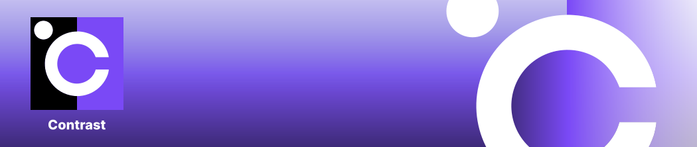

# Contrast

Contrast runs confidential container deployments on Kubernetes at scale.
Contrast runs confidential container deployments on Kubernetes at scale.

Contrast is based on the [Kata Containers](https://github.com/kata-containers/kata-containers) and
[Confidential Containers](https://github.com/confidential-containers) projects.
Confidential Containers are Kubernetes pods that are executed inside a confidential micro-VM and provide strong hardware-based isolation from the surrounding environment.
This works with unmodified containers in a lift-and-shift approach.
[Confidential Containers](https://github.com/confidential-containers) projects.
Confidential Containers are Kubernetes pods that are executed inside a confidential micro-VM and provide strong hardware-based isolation from the surrounding environment.
This works with unmodified containers in a lift-and-shift approach.
It currently targets the [CoCo preview on AKS](https://learn.microsoft.com/en-us/azure/confidential-computing/confidential-containers-on-aks-preview).

## Goal

Contrast is designed to keep all data always encrypted and to prevent access from the infrastructure layer, i.e., remove the infrastructure from the TCB. This includes access from datacenter employees, privileged cloud admins, own cluster administrators, and attackers coming through the infrastructure, e.g., malicious co-tenants escalating their privileges.

Contrast integrates fluently with the existing Kubernetes workflows. It's compatible with managed Kubernetes, can be installed as a day-2 operation and imposes only minimal changes to your deployment flow.

## Use Cases:

* Increasing the security of your containers
* Moving sensitive workloads from on-prem to the cloud with Confidential Computing
* Shielding the code and data even from the own cluster administrators
* Increasing the trustworthiness of your SaaS offerings
* Simplifying regulatory compliance
* Multi-party computation for data collaboration

## Features

### 🔒 Everything always encrypted

* Runtime encryption: All Pods run inside AMD SEV-based Confidential VMs (CVMs). Support for Intel TDX will be added in the future.
* PKI and mTLS: All pod-to-pod traffic can be encrypted and authenticated with Contrast's workload certificates.

### 🔍 Everything verifiable

* Workload attestation based on the identity of your container and the remote-attestation feature of [Confidential Containers](https://github.com/confidential-containers)
* "Whole deployment" attestation based on Contrast's [Coordinator attestation service](#the-contrast-coordinator)
* Runtime environment integrity verification based runtime policies
* Kata micro-VMs and single workload isolation provide a minimal Trusted Computing Base (TCB)

### 🏝️ Everything isolated

* Runtime policies enforce strict isolation of your containers from the Kubernetes layer and the infrastructure.
* Pod isolation: Pods are isolated from each other.
* Namespace isolation: Contrast can be deployed independently in multiple namespaces.

### 🧩 Lightweight and easy to use

* Install in Kubernetes cluster as a day-2 operation.
* Compatible with managed Kubernetes.
* Minimal DevOps involvement.
* Simple CLI tool to get started.

## Components

### The Contrast Coordinator

The Contrast Coordinator is the central remote attestation service of a Contrast deployment.
It runs inside a confidential container inside your cluster.
The Coordinator can be verified via remote attestation, and a Contrast deployment is self-contained.
The Coordinator is configured with a *manifest*, a configuration file containing the reference attestation values of your deployment.
It ensures that your deployment's topology adheres to your specified manifest by verifying the identity and integrity of all confidential pods inside the deployment.
The Coordinator is also a certificate authority and issues certificates for your workload pods during the attestation procedure.
Your workload pods can establish secure, encrypted communication channels between themselves based on these certificates and the Coordinator as the root CA.
As your app needs to scale, the Coordinator transparently verifies new instances and then provides them with their certificates to join the deployment.

To verify your deployment, the Coordinator's remote attestation statement combined with the manifest offers a concise single remote attestation statement for your entire deployment.
A third party can use this to verify the integrity of your distributed app, making it easy to assure stakeholders of your app's identity and integrity.

## The Manifest

The manifest is the configuration file for the Coordinator, defining your confidential deployment.
It is automatically generated from your deployment by the Contrast CLI.
It currently consists of the following parts:

* *Policies*: The identities of your Pods, represented by the hashes of their respective runtime policies.
* *Reference Values*: The remote attestation reference values for the Kata confidential micro-VM that is the runtime environment of your Pods.
* *WorkloadOwnerKeyDigest*: The workload owner's public key digest. Used for authenticating subsequent manifest updates.

## Runtime Policies

Runtime Policies are a mechanism to enable the use of the (untrusted) Kubernetes API for orchestration while ensuring the confidentiality and integrity of your confidential containers.
They allow us to enforce the integrity of your containers' runtime environment as defined in your deployment files.
The runtime policy mechanism is based on the Open Policy Agent (OPA) and translates the Kubernetes deployment YAMLs into OPA's Rego policy language.
The Kata Agent inside the confidential micro-VM then enforces the policy by only acting on permitted requests.
The Contrast CLI provides the tooling for automatically translating Kubernetes deployment YAMLs into OPA's Rego policy language.

The trust chain goes as follows:

1. The Contrast CLI generates a policy and attaches it to the pod definition.
2. Kubernetes schedules the pod on a node with kata-cc-isolation runtime.
3. Containerd takes the node, starts the Kata Shim and creates the pod sandbox.
4. The Kata runtime starts a CVM with the policy's digest as `HOSTDATA`.
5. The Kata runtime sets the policy using the `SetPolicy` method.
6. The Kata agent verifies that the incoming policy's digest matches `HOSTDATA`.
7. The CLI sets a manifest in the Contrast Coordinator, including a list of permitted policies.
8. The Contrast Coordinator verifies that the started pod has a permitted policy hash in its `HOSTDATA` field.

After the last step, we know that the policy has not been tampered with and, thus, that the workload is as intended.

### The Contrast Initializer

Contrast provides an Initializer that handles the remote attestation on the workload side transparently and
fetches the workload certificate. The Initializer runs as an init container before your workload is started.

## Installation

Download the latest CLI from our release and put it into your PATH:

```sh
curl -fLo contrast https://github.com/edgelesssys/contrast/releases/download/latest/contrast
mv contrast /usr/local/bin/contrast
```

## Generic Workflow

The following instructions will guide you through the process of making an existing Kubernetes deployment
confidential and deploying it together with Contrast.

### Prerequisite

A CoCo enabled cluster is required to run Contrast. Create it using the [`az`](https://docs.microsoft.com/en-us/cli/azure/) CLI:

```sh
az extension add \
  --name aks-preview

az aks create \
  --resource-group myResourceGroup \
  --name myAKSCluster \
  --kubernetes-version 1.29 \
  --os-sku AzureLinux \
  --node-vm-size Standard_DC4as_cc_v5 \
  --node-count 1 \
  --generate-ssh-keys

az aks nodepool add \
  --resource-group myResourceGroup \
  --name nodepool2 \
  --cluster-name myAKSCluster \
  --mode System \
  --node-count 1 \
  --os-sku AzureLinux \
  --node-vm-size Standard_DC4as_cc_v5 \
  --workload-runtime KataCcIsolation

az aks get-credentials \
  --resource-group myResourceGroup \
  --name myAKSCluster
```

Check [Azure's deployment guide](https://learn.microsoft.com/en-us/azure/aks/deploy-confidential-containers-default-policy) for more detailed instructions.

### Deploy the Contrast Coordinator

Install the latest Contrast Coordinator release, comprising a single replica deployment and a
LoadBalancer service, into your cluster.

```sh
kubectl apply -f https://github.com/edgelesssys/contrast/releases/download/latest/coordinator.yml
```

### Prepare your Kubernetes resources

Contrast will add annotations to your Kubernetes YAML files. If you want to keep the original files
unchanged, you can copy the files into a separate local directory.
You can also generate files from a Helm chart or from a Kustomization.

```sh
mkdir resources
kustomize build $MY_RESOURCE_DIR > resources/all.yml
```

or

```sh
mkdir resources
helm template release-name chart-name > resources/all.yml
```

To specify that a workload (pod, deployment, etc.) should be deployed as confidential containers,
add `runtimeClassName: kata-cc-isolation` to the pod spec (pod definition or template).
In addition, add the Contrast Initializer as `initContainers` to these workloads and configure the
workload to use the certificates written to the `tls-certs` volumeMount.

```yaml
spec: # v1.PodSpec
  runtimeClassName: kata-cc-isolation
  initContainers:
  - name: initializer
    image: "ghcr.io/edgelesssys/contrast/initializer:latest"
    env:
    - name: COORDINATOR_HOST
      value: coordinator
    volumeMounts:
    - name: tls-certs
      mountPath: /tls-config
  volumes:
  - name: tls-certs
    emptyDir: {}
```

### Generate policy annotations and manifest

Run the `generate` command generate the execution policies and add them as annotations to your
deployment files. A `manifest.json` with the reference values of your deployment will be created.

```sh
./contrast generate resources/*.yml
```

### Apply Resources

Apply the resources to the cluster. Your workloads will block in the initialization phase until a
manifest is set at the Coordinator.

```sh
kubectl apply -f resources/
```

### Connect to the Contrast Coordinator

For the next steps, we will need to connect to the Coordinator. The released Coordinator resource
includes a LoadBalancer definition we can use.

```sh
coordinator=$(kubectl get svc coordinator -o=jsonpath='{.status.loadBalancer.ingress[0].ip}')
```

> [!NOTE]
> `kubectl port-forward` uses a CRI method that is not supported by the Kata shim. If you
> cannot use a public load balancer, you can deploy a [deployments/simple/portforwarder.yml] and
> expose that with `kubectl port-forward` instead.
>
> Tracking issue: <https://github.com/kata-containers/kata-containers/issues/1693>.

### Set Manifest

Attest the Coordinator and set the manifest:

```sh
./contrast set -c "${coordinator}:1313" -m manifest.json resources/
```

After this step, the Coordinator will start issuing TLS certs to the workloads. The init container
will fetch a certificate for the workload and the workload is started.

### Verify the Coordinator

An end user (data owner) can verify the Contrast deployment using the `verify` command.

```sh
./contrast verify -c "${coordinator}:1313"
```

The CLI will attest the Coordinator using embedded reference values. The CLI will write the service mesh
root certificate and the history of manifests into the `verify/` directory. In addition, the policies referenced
in the manifest are also written to the directory.

### Communicate with Workloads

Connect to the workloads using the Coordinator's mesh root as a trusted CA certificate.
For example, with `curl`:

```sh
lbip=$(kubectl get svc ${MY_SERVICE} -o=jsonpath='{.status.loadBalancer.ingress[0].ip}')
curl --cacert ./verify/mesh-root.pem "https://${lbip}:8443"
```

## Current limitations

Contrast is in an early preview stage, and most underlying projects are still under development as well.
As a result, there are currently certain limitations from which we try to document the most significant ones here:

- Only available on AKS with CoCo preview (AMD SEV-SNP)
- Persistent volumes currently not supported in CoCo
- While workload policies are functional in general, but [not covering all edge cases](https://github.com/microsoft/kata-containers/releases/tag/genpolicy-0.6.2-5)
- Port-forwarding isn't supported by Kata Containers yet
- CLI is only available for Linux (mostly because upstream dependencies are not available for other platforms)

## Upcoming Contrast features

- Transparent service mesh (apps can currently use mTLS with Coordinator certs for secure communication)
- Plugin for a key management service (KMS) for attestation/coordinator certificate-based key release
- High availability (distributed Contrast Coordinator)

## Contributing

See the [contributing guide](CONTRIBUTING.md).
Please follow the [Code of Conduct](/CODE_OF_CONDUCT.md).

## Support

* If something doesn't work, make sure to use the [latest release](https://github.com/edgelesssys/contrast/releases/latest) and check out the [known issues](https://github.com/edgelesssys/contrast/issues?q=is%3Aopen+is%3Aissue+label%3A%22known+issue%22).
* Please file an [issue](https://github.com/edgelesssys/contrast/issues) to get help or report a bug.
* Visit our [blog](https://www.edgeless.systems/blog/) for technical deep-dives and tutorials and follow us on [LinkedIn](https://www.linkedin.com/company/edgeless-systems) for news.
* Edgeless Systems also offers [Enterprise Support](https://www.edgeless.systems/products/contrast/).
