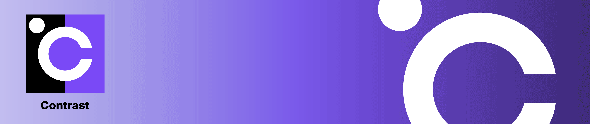
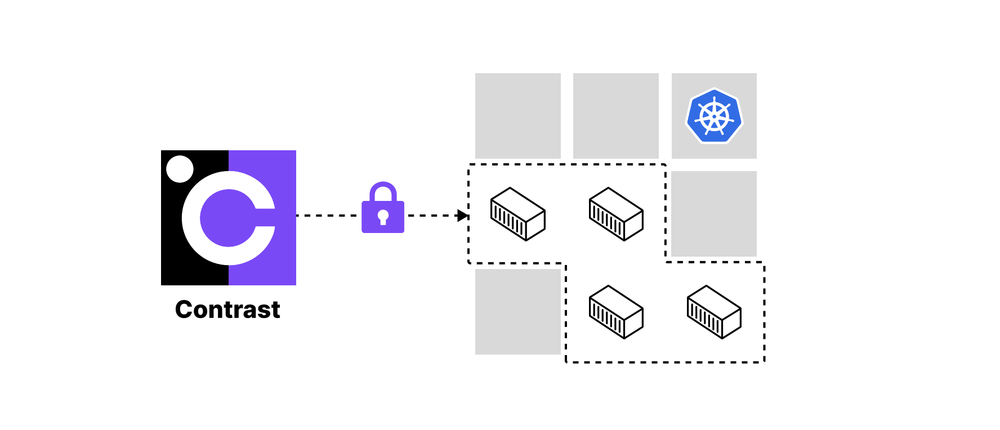

# Contrast

Contrast runs confidential container deployments on Kubernetes at scale.

Contrast is based on the [Kata Containers](https://github.com/kata-containers/kata-containers) and
[Confidential Containers](https://github.com/confidential-containers) projects.
Confidential Containers are Kubernetes pods that are executed inside a confidential micro-VM and provide strong hardware-based isolation from the surrounding environment.
This works with unmodified containers in a lift-and-shift approach.
Contrast currently targets the [CoCo preview on AKS](https://learn.microsoft.com/en-us/azure/confidential-computing/confidential-containers-on-aks-preview).

## Goal

Contrast is designed to keep all data always encrypted and to prevent access from the infrastructure layer. It removes the infrastructure provider from the trusted computing base (TCB). This includes access from datacenter employees, privileged cloud admins, own cluster administrators, and attackers coming through the infrastructure, for example, malicious co-tenants escalating their privileges.

Contrast integrates fluently with the existing Kubernetes workflows. It's compatible with managed Kubernetes, can be installed as a day-2 operation and imposes only minimal changes to your deployment flow.

## Use cases

* Increasing the security of your containers
* Moving sensitive workloads from on-prem to the cloud with Confidential Computing
* Shielding the code and data even from your own cluster administrators
* Increasing the trustworthiness of your SaaS offerings
* Simplifying regulatory compliance
* Multi-party computation for data collaboration

## Features

### 🔒 Everything always encrypted

* Runtime encryption: All Pods run inside AMD SEV-based Confidential VMs (CVMs). Support for Intel TDX will be added in the future.
* PKI and mTLS: All pod-to-pod traffic can be encrypted and authenticated with Contrast's workload certificates.

### 🔍 Everything verifiable

* Workload attestation based on the identity of your container and the remote-attestation feature of [Confidential Containers](https://docs.edgeless.systems/contrast/basics/confidential-containers)
* "Whole deployment" attestation based on Contrast's [Coordinator attestation service](https://docs.edgeless.systems/contrast/components#the-coordinator)
* Runtime environment integrity verification based runtime policies
* Kata micro-VMs and single workload isolation provide a minimal Trusted Computing Base (TCB)

### 🏝️ Everything isolated

* Runtime policies enforce strict isolation of your containers from the Kubernetes layer and the infrastructure.
* Pod isolation: Pods are isolated from each other.
* Namespace isolation: Contrast can be deployed independently in multiple namespaces.

### 🧩 Lightweight and easy to use

* Install in Kubernetes cluster as a day-2 operation.
* Compatible with managed Kubernetes.
* Minimal DevOps involvement.
* Simple CLI tool to get started.

## Documentation

To learn more, see the [documentation](https://docs.edgeless.systems/contrast).
You may want to start with one of the following sections.

* [Getting started](https://docs.edgeless.systems/contrast/getting-started)
* [Security benefits](https://docs.edgeless.systems/contrast/basics/security-benefits)
* [Components](https://docs.edgeless.systems/contrast/components)

## Known limitations

See the current list of [known limitations](https://docs.edgeless.systems/contrast/features-limitations) in the documentation.

## Upcoming Contrast features

* Plugin for a key management service (KMS) for attestation/coordinator certificate-based key release
* High availability (distributed Contrast Coordinator)

## Contributing

See the [contributing guide](CONTRIBUTING.md).
Please follow the [Code of Conduct](/CODE_OF_CONDUCT.md).

## Support

* If something doesn't work, make sure to use the [latest release](https://github.com/edgelesssys/contrast/releases/latest) and check out the [known issues](https://github.com/edgelesssys/contrast/issues?q=is%3Aopen+is%3Aissue+label%3A%22known+issue%22).
* Please file an [issue](https://github.com/edgelesssys/contrast/issues) to get help or report a bug.
* Visit our [blog](https://www.edgeless.systems/blog/) for technical deep-dives and tutorials and follow us on [LinkedIn](https://www.linkedin.com/company/edgeless-systems) for news.
* Edgeless Systems also offers [Enterprise Support](https://www.edgeless.systems/products/contrast/).
