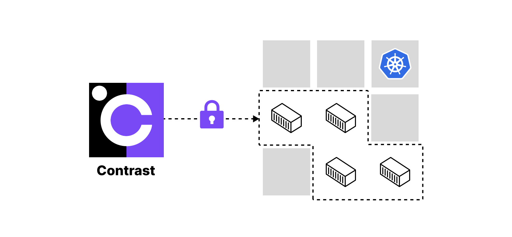

# Contrast

Contrast runs confidential container deployments on Kubernetes at scale.

Contrast is based on the [Kata Containers](https://github.com/kata-containers/kata-containers) and
[Confidential Containers](https://github.com/confidential-containers) projects.
Confidential Containers are Kubernetes pods that are executed inside a confidential micro-VM and provide strong hardware-based isolation from the surrounding environment.
This works with unmodified containers in a lift-and-shift approach.

## Goal

Contrast is designed to keep all data always encrypted and to prevent access from the infrastructure layer. It removes the infrastructure provider from the trusted computing base (TCB). This includes access from datacenter employees, privileged cloud admins, own cluster administrators, and attackers coming through the infrastructure, for example, malicious co-tenants escalating their privileges.

Contrast integrates fluently with the existing Kubernetes workflows. It's compatible with managed Kubernetes, can be installed as a day-2 operation and imposes only minimal changes to your deployment flow.

## Use cases

* Increasing the security of your containers
* Moving sensitive workloads from on-prem to the cloud with Confidential Computing
* Shielding the code and data even from your own cluster administrators
* Increasing the trustworthiness of your SaaS offerings
* Simplifying regulatory compliance
* Multi-party computation for data collaboration

## Features

### 🔒 Everything always encrypted

* Runtime encryption: All Pods run inside Confidential VMs (CVMs), protected by in-use memory encryption.
* PKI and mTLS: All pod-to-pod traffic can be encrypted and authenticated with Contrast's workload certificates.
* Secure state: Support for encrypted and integrity-protected state disks for pods.
* Support for attestation-based unsealing of encrypted secret management solutions.

### 🔍 Everything verifiable

* Workload attestation on Kubernetes pod level, includes container images
* Transitive attestation of multi-pod deployments
* Verifiable security for third-party auditors

### 🏝️ Everything isolated

* Runtime policies enforce strict isolation of your containers from the Kubernetes layer and the infrastructure.
* Pod isolation: Pods are isolated from each other.

### 🧩 Lightweight and easy to use

* Install in Kubernetes cluster as a day-2 operation.
* Compatible with managed Kubernetes.
* Minimal DevOps involvement.
* Simple CLI tool to get started.
* Can be deployed independently in multiple namespaces within the same cluster.

## Documentation

To learn more, see the [documentation](https://docs.edgeless.systems/contrast).

## Contributing

See the [contributing guide](CONTRIBUTING.md).
Please follow the [Code of Conduct](/CODE_OF_CONDUCT.md).

## Support

* If something doesn't work, make sure to use the [latest release](https://github.com/edgelesssys/contrast/releases/latest) and check out the [known issues](https://github.com/edgelesssys/contrast/issues?q=is%3Aissue%20state%3Aopen%20label%3Abug).
* Please file an [issue](https://github.com/edgelesssys/contrast/issues) to get help or report a bug.
* Edgeless Systems offers [Enterprise Support](https://www.edgeless.systems/products/contrast/) for Contrast.
