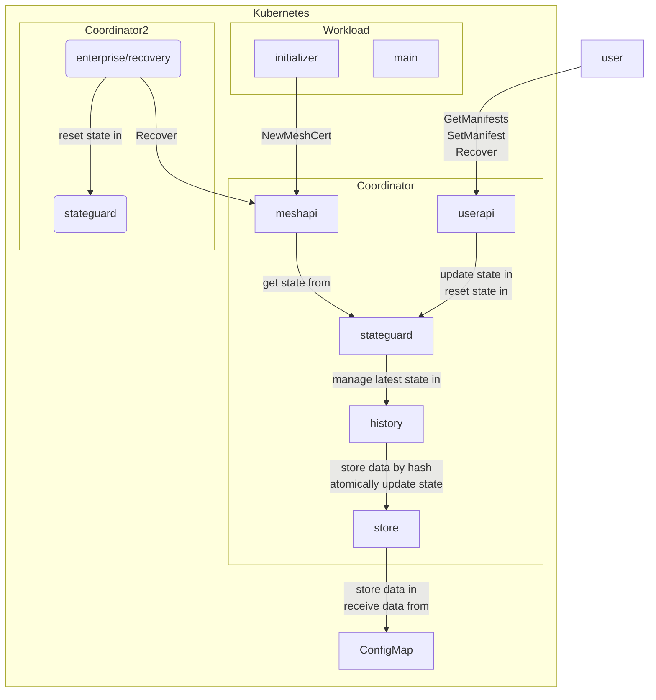

# Contrast Coordinator

The Coordinator is the central service in a Contrast deployment.
It exposes an API to set manifests and to get the history of manifests, and it verifies workloads according to the current manifest.
The below diagram shows how the Coordinator packages interact in the enterprise version.

