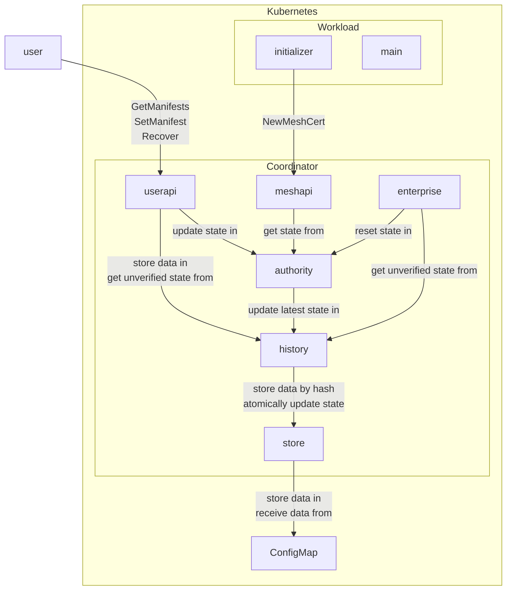

# Contrast Coordinator

```mermaid
graph TB
    subgraph Coordinator
            userapi -->|update state in| authority
            meshapi -->|get state from| authority
            enterprise -->|reset state in| authority
            userapi -->|store data in<br/>get unverified state from| history
            authority -->|update latest state in| history
            enterprise -->|get unverified state from| history
            history -->|store data by hash<br/>atomically update state| store

    end

    subgraph Workload
        initializer -->|NewMeshCert| meshapi
        main
    end

    subgraph Kubernetes
        Workload
        Coordinator
        ConfigMap
    end


    store -->|store data in<br/>receive data from| ConfigMap

    user -->|GetManifests<br/>SetManifest<br>Recover| userapi
```
