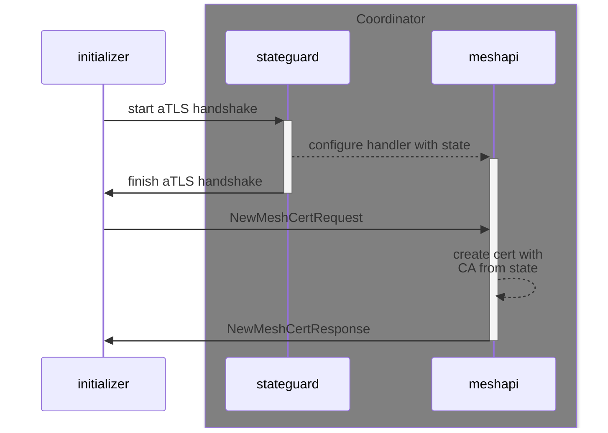
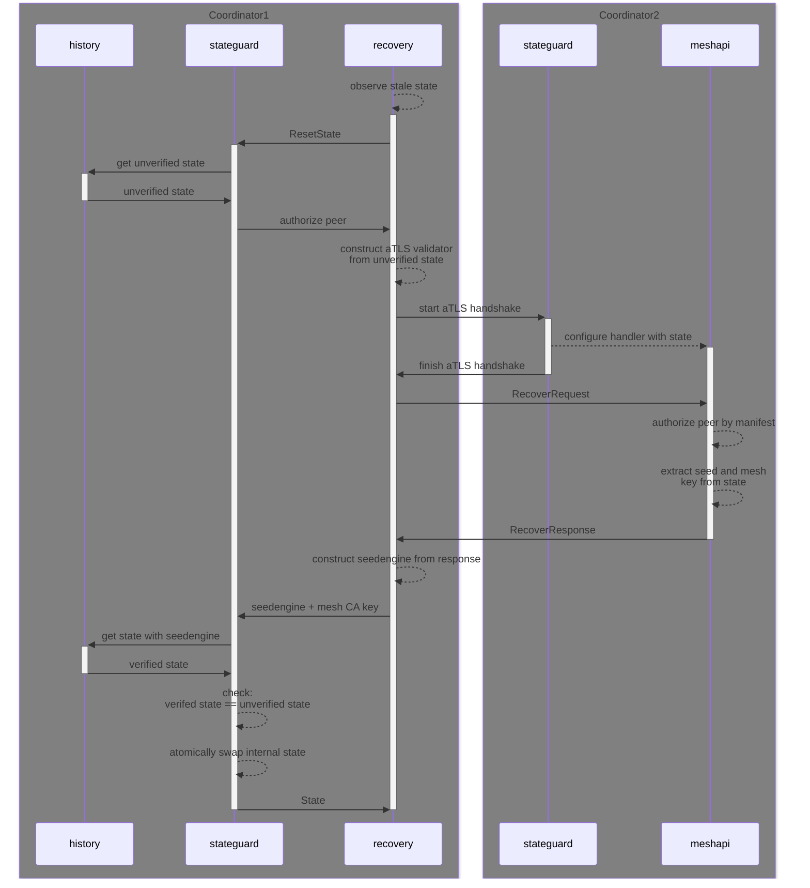

# Mesh API

The `meshapi.MeshAPI` service serves requests from Contrast workloads and other Coordinators.
Below are some sequence diagrams that illustrate the data flow for each request type.

## `NewMeshCert`

This RPC is called by initializers that want to act as Contrast workloads.

## `Recover`

This RPC is called by peer Coordinators that need to recover their internal state.
In the diagram below, this is `Coordinator1` attempting to recover from `Coordinator2`.

