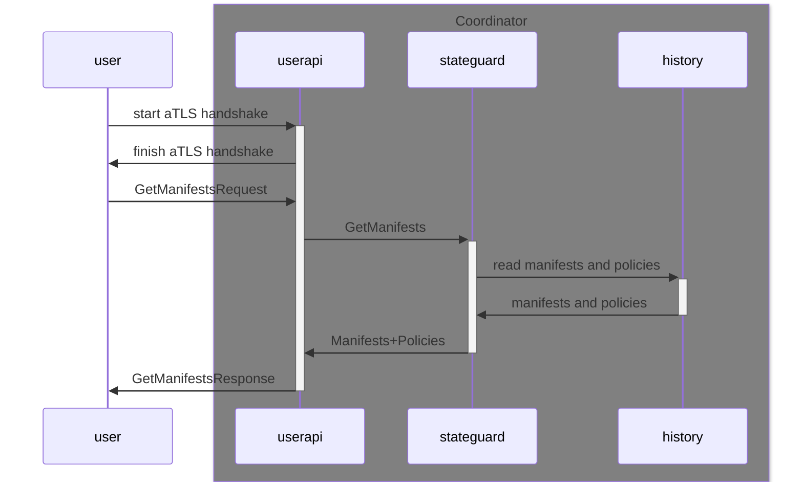
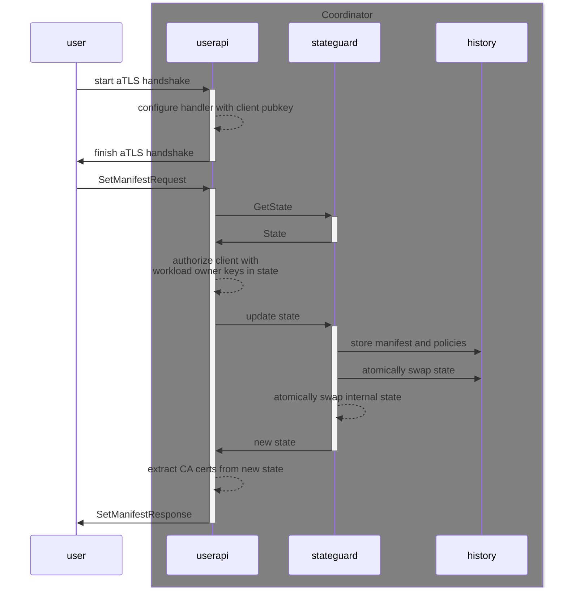
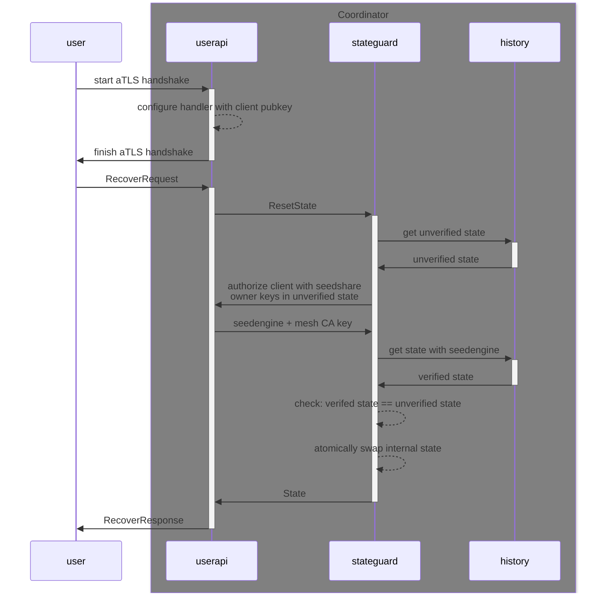

# User API

The `userapi.UserAPI` service serves requests from Contrast users (data owners, workload owners and seed share owners).
A detailed description of this package's layout and responsibilities resides in the package comment.
Below are some sequence diagrams that illustrate the data flow for each request type.

## `GetManifests`

Primary audience of this RPC are data owners that want to verify the Coordinator, inspect the current manifest and retrieve the CA certificates.

## `SetManifest`

This RPC allows workload owners to update the current manifest.

## Recover

This RPC allows seed share owners to recover a Coordinator that lost its internal state after a restart.

