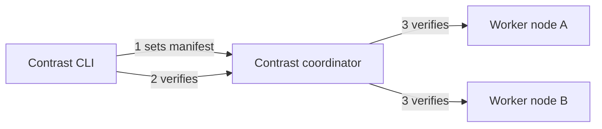

# Contrast security overview

This document provides a security overview of Contrast. It describes the components involved and explains how Contrast integrates confidential containers into a Kubernetes cluster.

Since the architecture is largely consistent across platforms, this overview focuses primarily on **AMD SEV-SNP with bare-metal nodes**. It also highlights key differences for managed Kubernetes on AKS and bare-metal setups using Intel TDX.

## Architectural goals

The Contrast architecture is designed to deliver four key properties:

- **Isolation:** Workloads and processed data remain inaccessible to the infrastructure provider by running pods—a group of containers—inside Confidential Virtual Machines (CVMs). This setup leverages runtime memory encryption and enforces end-to-end confidentiality and authenticity across all cluster communication.

- **Attestation:** Workload integrity is verified using hardware-based, provider-independent attestation mechanisms, ensuring that only verified and trusted workloads are executed.

- **Integration:** Contrast provides a custom Kubernetes runtime enabling workloads to run securely inside CVMs, along with Contrast-specific components responsible for workload attestation. Both elements can be integrated into existing Kubernetes clusters with minimal impact on current development workflows.

- **Full transparency:** All reference values defining the trusted state are fully transparent, available through open-source code and reproducible builds.

For details, visit the [Contrast documentation](https://docs.edgeless.systems/contrast/basics/security-benefits).

## Contrast roles

In the context of Contrast there are three key roles:

- **Container image provider**: Creates container images that package the application and its dependencies.

- **Workload operator**: Deploys and manages workloads in a Kubernetes cluster. The operator typically has full administrative privileges over the deployment and can manage cluster resources such as nodes, volumes, and networking rules. The operator can also interact with Kubernetes APIs and the underlying cloud infrastructure.

- **Data owner**: Owns the protected data and is responsible for verifying the deployment using the coordinator attestation service. This verification ensures the identity, integrity, and confidentiality of workloads, the runtime environment, and access permissions. A data owner can, for example, be a user of a deployed SaaS application.

For details, visit the [Contrast documentation](https://docs.edgeless.systems/contrast/basics/security-benefits#personas-in-a-contrast-deployment).

## Key components

Contrast is built on four key components:

- **Contrast Kubernetes runtime**: Contrast comes with a custom Kubernetes `RuntimeClass` that specifies the runtime handler used by `containerd` to manage container execution. A custom runtime handler is used to run containers inside Confidential Virtual Machines (CVMs). Contrast’s runtime is based on the [Kata Container runtime](https://katacontainers.io/) and the [Confidential Containers (CoCo)](https://confidentialcontainers.org/) project.

- **Contrast coordinator**: An additional service that's deployed to the cluster and itself runs within a CVM using the Contrast custom runtime. It serves as the central attestation service, ensuring that only verified workloads are admitted into the trusted service mesh. It's configured with the **manifest**, a configuration file (.json) that defines the trusted reference state of your cluster. It specifies cryptographic hashes for all application workloads The Contrast coordinator ensures that CVM attestations are always verified against this manifest before initialized as trusted

- **Service Mesh:** The Contrast coordinator functions as a Certificate Authority (CA), issuing certificates exclusively to successfully attested workloads, thereby establishing a trusted service mesh.

- **Contrast CLI**: A command-line tool to verify the integrity and authenticity of the coordinator and the entire deployment via remote attestation. It can also be used by data owners to verify a deployment. As it serves as a root of trust for the deployment, ensuring its integrity and authenticity is crucial for both the workload operator and data owner. It's also used for automatically pre-processing deployment files, adjusting them for a secure Contrast integration.



For details, visit the [Contrast documentation](https://docs.edgeless.systems/contrast/components/overview).

## Runtime Policy

A key element of a CVM in Contrast is its runtime policy, a fundamental component of Kata Containers. The runtime policy is attached to the CVM and enforced by the `kata-agent`, which runs within the CVM. It strictly regulates and verifies host-to-CVM communication, ensuring that:

- Only approved workload images can be started inside the CVM.
- Execution of additional unauthorized processes is prohibited.
- Unexpected environment variables can't be injected.

A CVM's runtime policy is automatically generated by the Contrast CLI based on the initial pod definition in the deployment YAML.

Runtime policies are written in [Rego](https://www.openpolicyagent.org/docs/latest/policy-language/) and are automatically added to the pod definition as Base64-encoded annotations in the deployment YAML.

For details, visit the [Contrast documentation](https://docs.edgeless.systems/contrast/components/policies).

## Attestation

Attestation is a key mechanism of confidential computing that enables hardware-enforced, provider-independent verification of CVMs.

The integrity and authenticity of CVMs are verified through attestation. Each creation of a CVM generates a hardware-enforced attestation report, which is signed using a private key. This private key is derived from a vendor-introduced secret embedded in the chip during production. As a result, the attestation report serves as independent evidence of the CVM's state. It's signed by:

- **The Versioned Chip Endorsement Key (VCEK)**: A unique key derived from the chip's embedded secret and its security version number.

The signature is verified using AMD's official PKI.

The report includes the following information:

- **Measurement**: A cryptographic digest of the CVM's initial memory pages at launch, including the kernel, initramfs, and kernel command line.

- **Runtime Policy Hash**: A cryptographic digest of the enforced CVM's runtime policy.

- **Miscellaneous**: Details such as the chip identifier, platform information, and microcode versions.

### Manifest

The manifest, enforced by the Contrast coordinator, contains reference values used to verify all application pods. It can be seen as the trusted reference state of the deployment. The manifest includes:

- **Policies:** One cryptographic hash per pod, representing its enforced runtime policy.
- **ReferenceValues**: The launch digests of the CVMs, based on AMD SEV-SNP. This doesn't include any application code but tracks the setup of the CVM. Confidential Pods on the same CPU have the same reference values.
- **WorkloadOwnerKeyDigests**: A public key digest used to authenticate subsequent manifest updates.
- **SeedshareOwnerPubKeys**: Used for coordinator recovery. For details, see [later sections](#secret-recovery).

Reference values in this manifest are transparent to users through open-source code and reproducible builds.

Here is an example manifest:

```json

  "Policies": {
    "1c24233516f95303d174b7d61dd4bb447a141468186dbcb9eed696cef4461dfc": {
      "SANs": ["workload", "*"],
      "WorkloadSecretID": "apps/v1/StatefulSet/continuum-9344c1/workload"
    },
    "35628602194aa8081fb2d7d1185176be6faffb1759986b5bf3b21145e1c7b396": {
      "SANs": [
        "secret-service",
        "*",
        "secret-service-internal.continuum-9344c1.svc.cluster.local",
        "staging.secret.privatemode.ai",
        "secret.privatemode.ai"
      ],
      "WorkloadSecretID": "apps/v1/Deployment/continuum-9344c1/secret-service"
    }
  },
  "ReferenceValues": {
    "snp": [
      {
        "MinimumTCB": {
          "BootloaderVersion": 9,
          "TEEVersion": 0,
          "SNPVersion": 21,
          "MicrocodeVersion": 72
        },
        "ProductName": "Genoa",
        "TrustedMeasurement": "92a34339f1e1ec94b911830cafa875082d4f51b9805f3c2638ce468c6fda038be5acaca52fea5cb767e18cc1edfb1f7c"
      }
    ]
  },
  "WorkloadOwnerKeyDigests": [
    "8972d7e33267e30ae8acdd46ad53856d5cae7eb6b3afb84dd227394e01605cd4"
  ],
  "SeedshareOwnerPubKeys": [
    "3082020a0282020100cd9bef5d3181800d1a87e843b2be7608511f2328c22e7e63ae5e75605d211249a8f3985b8ead0a3f8f7042bbd58a35475566bd4625d692e7e6c9d09456b049d976c7d14943498f14a5fe3a80f320c5021e0d03c63ab01207b1d5005e5267daf84caa39ddda01d1b3477777b7bc0526f23df7ef53afe5283d903d0c24c23d9936ee197181e3b262dbcbdfc7ea85d9bbb7fab331843ecb1e763b130693fc39aa202624845384a17e0ff5cc8517cf53b5a36aa2c48b6244c5faea8d7e8f8942704635cd860e237fadd2e11712e1cc5322c0d53f773e18c3035793a5f0737b22a849eed2e634401889dd826ef23870bc9ed1e0f8c86cb99f5e6b161bc6c6c804a7d98572f4950a4f06e4b2a0012e710eeb697aa33f4caab818206c7ddfc86280dcf9d1944d83272cd722252e50a4c9f73b210da8861160f5c469033a9258f02e3b6088d2c041c4bcebd9dd4a275525ee67e919a62d1fabb74be2092821ad39672cfe4f3861311f81b087d73cf79246703b1566b01af65eee8c39503694cc8569308394f6403dea67b018a5e109f9151d5b332f77dc2c01ceb9a180cf40205d3fdb6a6823d0bc67f2d4e38fc6b6186f36347ff91e2b873db830c4dfe0ec065a71878920dc90e2d45dedd466d603d3fcfe0e86e50033e959d015f3990de37ede316e4a9413704c5d9f8b7481460d1c8600a6ef8138f6e07f225db34df8030849ea5ff90203010001"
  ]

```

For details, see the [Contrast documentation](https://docs.edgeless.systems/contrast/architecture/attestation).

## Trusted service mesh

The **Contrast coordinator** acts as a **Certificate Authority (CA)**. It issues X.509 certificates to attested worker nodes, allowing them to join a trusted service mesh.

The coordinator itself functions as a two-tier certificate authority:

- **Root CA**: The Root CA's private key signs the Intermediate CA certificate.

- **Intermediate CA**: The Intermediate CA issues certificates for attested workloads. If the deployment and its manifest changes, the signing key used to issue service mesh certificates to workloads is also changed. As a result, the so-called Mesh CA certificate is updated.

Two certificates are relevant when verifying workloads and workload communication:

- **The Root CA certificate**: This certificate is long-term and serves as the foundation of trust. Using the Root CA certificate for workload verification requires trust in future deployment updates, meaning the workload operator is trusted.

- **The Mesh CA certificate**: Using the Mesh CA certificate for workload verification ensures that any changes to the deployment are detectable. If the deployment is modified and the manifest is updated, the Mesh CA certificate becomes obsolete. As a result, verification fails when establishing authenticated TLS connections based on the obsolete Mesh CA certificate instead of the Root CA certificate.

Both the Root CA certificate and the Mesh CA certificate are provided to the workload operator or data owner when they first verify the deployment via the CLI against a trusted reference manifest.

For details, see the [Contrast documentation](https://docs.edgeless.systems/contrast/architecture/certificates).

### Configuration

Whether mTLS connections based on service-mesh certificates should be used for incoming and outgoing traffic of pods can be configured by using annotations in the deployment YAML.

For details, see the [Contrast documentation](https://docs.edgeless.systems/contrast/components/service-mesh#configuring-the-proxy).

## Contrast integration flow

This section provides a high-level overview of how Confidential Virtual Machines (CVMs) are created and managed on worker nodes. It shows how pods are run within CVMs, starting from blank Kubernetes nodes. It outlines the following steps:

1. **Preparing a Kubernetes cluster**
2. **Setting up worker node hosts**
3. **Setting up a CVM**
4. **Running workloads within the CVM**
5. **Setting up Contrast-specific containers on worker nodes**
6. **Including workloads in the Contrast service mesh**
7. **Verifying integrity**

### 1️. Preparing a Kubernetes cluster

You can set up a new cluster using a lightweight distribution like K3s, or integrate Contrast directly into your existing Kubernetes cluster.

The only requirement is that the cluster must be confidential-computing-ready. This means the underlying hardware of worker nodes must support **AMD SEV-SNP** or **Intel TDX** for bare-metal deployments.

Managed Kubernetes like AKS offers some CoCo-enabled node pools with nested virtualization, as nodes in case of AKS aren't bare-metal machines but already virtualized. See the [Contrast documentation](https://docs.edgeless.systems/contrast/getting-started/cluster-setup) for details.

Additionally, some [initial adjustments](https://docs.edgeless.systems/contrast/getting-started/bare-metal?vendor=amd) need to be made to the worker nodes.

### 2️. Setting up worker node hosts

Each worker node prepares a **host environment** to run pods inside **Confidential Virtual Machines (CVMs).**

#### 1.Installing essential components on blank nodes

When an uninitialized node (with only a basic node OS installed) joins the cluster (for example via K3s), K3s automatically installs:

1. **Kubelet:** Manages pod lifecycles and communication with the Kubernetes control plane.
2. **Container runtime (`containerd`):** Essential for running containers, including the `DaemonSet` used for further node setup.

#### 2. Deploying the runtime handler and node installer (`DaemonSet`)

The workload operator deploys a custom runtime handler and node installer (`DaemonSet`) to Kubernetes.

- Deployment file: [runtime-k3s-qemu-snp.yml](https://github.com/edgelesssys/contrast/releases/download/v1.5.1/runtime-k3s-qemu-snp.yml)
- Purpose:
  - The `DaemonSet` configures the host environment on the node.
  - The runtime handler enables the creation of CVMs for running workload pods.

#### 3. Kubelet initializes the `DaemonSet` on worker nodes

1. Kubelet continuously listens for newly scheduled pods.
2. Kubelet retrieves the `DaemonSet` pod configuration from the Kubernetes API server.
3. Kubelet instructs `containerd` to pull the required container images and start the `DaemonSet` pod.

#### 4. `DaemonSet` configures the node's host environment

Once scheduled, the `DaemonSet` node-installer installs and configures the necessary components to enable CVM execution:

1. Installs the Contrast-specific `containerd` shim (`containerd-shim-contrast-cc-v2`).
2. Installs `QEMU` as the hypervisor.
3. Deploys the required files for booting the CVM:
   - **Kernel image**: The minimal guest OS kernel that runs inside the CVM.
   - **Initramfs**: A minimal filesystem used during early boot.
   - **Kernel command line**: Boot parameters, including security settings such as `dm-verity` root hash.
4. Installs a read-only root filesystem image for pod-CVMs of this class.
5. Updates `containerd` configuration by adding a runtime plugin corresponding to the specified `handler` (`containerd-shim-contrast-cc-v2`) defined in the Kubernetes `RuntimeClass`.
6. Restarts `containerd` to apply the new runtime configuration.

After these steps, the worker node is fully configured and ready to run Confidential Virtual Machines (CVMs), where workload pods will execute.

### 3️. Setting up a CVM

#### 1. The kata runtime plugin initializes the CVM

- The installed runtime plugin (`containerd-shim-contrast-cc-v2`, referenced by the runtime handler) initializes the Confidential Virtual Machine (CVM) using `QEMU`.
- `QEMU` initializes the CVM’s virtualized environment.
- AMD SEV-SNP enforces memory encryption: Guest memory is encrypted using a per-VM encryption key, ensuring host isolation.
- During CVM launch, `QEMU` uses the KVM interface to register guest memory—such as the kernel, kernel command line, and initramfs—with the AMD SEV-SNP firmware for measurement and protection.
- SEV-SNP firmware measures the contents of the guest memory, computing a launch digest that reflects the initial memory state of the CVM.
- Before finalizing the CVM launch,`QEMU` provides `HOSTDATA` to the CVM during the `SNP_LAUNCH_FINISH` operation. This data is sealed by the SEV-SNP firmware.
  - `HOSTDATA` contains a hardware-enforced SHA-256 hash of the runtime policy.
  - Although `HOSTDATA` isn't included in the initial memory image, it's always embedded and cryptographically signed as part of the attestation report.

For details, visit the [Contrast documentation](https://docs.edgeless.systems/contrast/architecture/snp).

#### 2. Kernel and initramfs initialization

- `QEMU` boots the kernel via [`OMVF`](https://github.com/tianocore/tianocore.github.io/wiki/OVMF) which executes the initialization process of `initramfs`, a minimal filesystem used during the initial boot phase.
- The `initramfs` initialization procedure parses parameters provided via the kernel command line. The command line includes:
  - Explicit instructions for the boot sequence, system initialization, and filesystem mounts.
  - The `dm-verity` hash, used to verify the integrity of the root filesystem.

#### 3. `initramfs` prepares the root filesystem

- The `initramfs` executes an initialization (`init`) process, running scripts that mount the root filesystem using the kernel's built-in `dm-verity` driver.
- After successfully mounting and verifying the root filesystem, the `initramfs` transfers control to the `systemd` process located within the root filesystem.

#### 4. `kata-agent` starts and verifies policy integrity

- The `kata-agent` starts in user mode inside the CVM.
- All communication between the host and CVM is handled via the `kata-agent`.
- During pod initialization, the runtime shim invokes the `SetPolicy` function of the `kata-agent`, which performs the following actions:
  - Retrieves the full policy document, provided as a Base64-encoded annotation in the deployment YAML. This annotation is passed by `Kubelet` to `containerd`.
  - Computes a fresh SHA-256 hash of the received policy document.
  - Compares this computed hash against the hash stored in `HOSTDATA`.
  - If the hashes don't match, the CVM immediately aborts execution to prevent policy violations.
- The `kata-agent` securely exposes the `AgentService` RPC interface over `virtio-vsock`, ensuring all host-to-CVM communications conform to the verified policy.

After completing these steps, the CVM is fully initialized and ready to execute workloads securely.

### 5. Running workloads within the CVM

The `kata-agent` inside the CVM is responsible for launching, verifying, and managing workloads within the guest environment.

1. The `nydus-snapshotter` plugin in `containerd` fetches container metadata and forwards it to the `kata-agent` inside the CVM.
2. The `kata-runtime` on the host generates an OCI runtime specification that describes how the container should be executed. This spec is passed to the `kata-agent` and checked against the security policy.
3. The `kata-agent` then pulls the container images (via the `image-rs` library) and computes their hashes.
4. The computed hashes are verified against those defined in the security policy.
5. If both the runtime spec and the image hashes match the policy, the `kata-agent` starts the container workload inside the CVM.

After completing these steps, the workload runs securely within a confidential environment.

### 6. Setting up Contrast-specific containers on worker nodes

Each CVM pod includes two additional containers that start before the primary application container:

#### **Init container**

- Runs to completion before the main application container starts.
- Obtains a service mesh certificate, enabling the pod to join the internal service mesh managed by the Contrast coordinator.
- Its integrity is enforced and verified according to the security policy.

#### **Sidecar container**

- Runs as a sidecar container alongside the application, providing a network proxy.
- Activated via annotations in the deployment YAML, enabling per-workload configuration of ingress and egress behavior.
- Handles ingress traffic by default, redirecting it through the proxy using `iptables` and intercepting it via [TPROXY](https://docs.kernel.org/networking/tproxy.html).
  - Ingress can be disabled entirely or configured to skip client authentication.
- Egress traffic isn't redirected by default but can be explicitly routed through the proxy if required.
- Based on [**Envoy**](https://www.envoyproxy.io/), managing mutual TLS (mTLS) encryption for ingress and egress traffic.
- The proxy’s integrity is enforced through the same security policy as the application container.
- For more details, see the [service mesh documentation](https://docs.edgeless.systems/contrast/1.9/components/service-mesh).

This setup ensures that the CVM can be reliably attested and communications is sufficiently protected.

### 6️. Including workloads in the Contrast service mesh

#### 1. The init container inside the CVM pod generates a cryptographic key pair (private and public).

- The private key remains securely inside the CVM and is never exposed externally.

#### 2. The init container of the CVM pod on the worker node establishes an attested TLS (aTLS) connection with the Contrast coordinator:

- The TLS protocol is extended to include attestation verification of the server.
- The worker node must successfully pass attestation against the defined manifest before the TLS connection is fully established.
- Only after successful attestation does the coordinator issue a valid service mesh certificate.

#### 3. The init container requests a service mesh certificate from the Contrast coordinator via rRPC, providing its public key.

#### 4. The coordinator securely delivers the service mesh certificate (signed by the Intermediate CA) to the Init container.

- Additionally, it provides a workload seed.

#### 5. The init container encrypts the service mesh private key for persistent storage:

- Derives a key from the provided workload seed.
- Applies [LUKS encryption](https://access.redhat.com/solutions/100463) to securely store the encrypted service-mesh private key and certificate chain on an untrusted persistent volume.

These steps ensure that only attested workloads can join the trusted service mesh. By relying exclusively on this service mesh for communication, workloads and data owners have assurance that they're interacting solely with trusted services defined by the configured manifest.

### 7️. **Verifying cluster integrity**

The data owner or workload operator verifies the integrity and confidentiality of the Kubernetes cluster using the Contrast CLI.

#### 1. The CLI includes reference hashes

- The Contrast CLI is distributed with embedded reference hashes (launch digest and policy hash) for the Contrast coordinator.
- Users can independently generate and validate these reference hashes through reproducible builds.

#### 2. The CLI generates the security manifest

- The CLI processes and annotates Kubernetes deployment YAML files (including Base64-encoded policy annotations), then generates the manifest using the `generate` command.

#### 2. The CLI establishes an attested TLS (aTLS) connection to the Contrast coordinator

- By initiating the manifest upload through the `set` command, The CLI initiates an aTLS connection to the Contrast coordinator.
- The TLS protocol is extended to verify the coordinator's attestation report against the reference hashes embedded in the CLI.
- If attestation succeeds, the CLI establishes a trusted, authenticated aTLS session.

#### 4. The CLI uploads the manifest to the coordinator

- The generated manifest is uploaded to the coordinator using the CLI's `set` command.
- This manifest defines the reference state for trusted deployments within the cluster.

#### 5. The CLI verifies the cluster state

- After deployment, the CLI verifies the currently enforced manifest using the `verify` command.
- The Root CA certificate and the Mesh CA certificate for the service mesh are returned to confirm the trusted cluster configuration.

**Verification ensures:**

- The actual deployed state matches the expected trusted state.
- Root CA and Mesh CA certificates of the service mesh are provided securely to workload operators and data owners.

## Attestation scope

This section provides a concise overview of key components whose integrity is verified—either directly or indirectly—through remote attestation:

### Launch measurement

The CPU generates a hardware-enforced cryptographic hash of the files initially loaded into memory, known as the launch measurement. This measurement guarantees the integrity of the following components:

- **Kernel and kernel command line**
- **Minimal init filesystem (`initramfs`)**
- **Root filesystem:** Verified indirectly since the kernel includes `dm-verity` drivers, and the root filesystem’s reference hash is provided as part of the kernel command line.
- **`kata-agent`:** Located within the verified root filesystem.

### `HOSTDATA`

In addition, the CPU integrates the `HOSTDATA` field into the attestation report:

- `HOSTDATA` is a hardware-enforced field always included in attestation reports.
- It holds the cryptographic hash of the runtime policy enforced by the `kata-agent`.

### `REPORTDATA`

`REPORTDATA` is supplied by the CVM and contains a hash of a nonce combined with the CVM's TLS public key. The nonce is provided by the relying party—that is, the entity requesting the attestation report. This securely binds the TLS key to the specific CVM instance and ensures the freshness of the attestation, preventing replay attacks.

## Secret recovery

A seed generated by the Coordinator is used to re-establish the trusted state of a deployment.

Using the `generate` command, the CLI creates a public/private key pair known as the seed owner key pair. The public key is then provided to the Coordinator when setting the manifest. The public key is used by the Coordinator to persistently encrypt the secret seed, which is required for future recovery.

Once the manifest is set, the Coordinator returns the seed—encrypted with the seed owner public key using RSA-OAEP. This ensures that only the holder of the seed owner private key can decrypt the seed and later send it back to a recovered Coordinator after verifying its integrity.

### What's derived from the recovery seed?

- **Manifest Signing Key**: Used to ensure integrity and authenticity of the manifest stored on untrusted persistent volumes.
- **Workload Secret Seeds**: Distributed securely to attested workloads, enabling them to derive encryption keys for securely storing sensitive data (for example secret keys) on untrusted persistent volumes.
- **Root CA Key**: Signing key of the Root CA.

### Why is the recovery seed important?

- It enables the secure restoration of sensitive data stored in persistent volumes.
- Since the seed provides access to encrypted secrets, it must remain strictly confidential.

## Example practical workflow

You can follow the [Confidential emoji voting tutorial](https://docs.edgeless.systems/contrast/examples/emojivoto) as an example of a practical deployment workflow.

## Supported Platforms

### Intel TDX

The architecture and considerations outlined in this document remain valid for Intel TDX deployments, with some terminology changes:

- Intel TDX uses the `MRCONFIGID` field, which is equivalent to AMD SEV-SNP’s `HOSTDATA`.

### Azure Kubernetes Service (AKS)

Contrast can also be deployed on Azure Kubernetes Service (AKS). In this scenario, Kubernetes nodes run as virtual machines instead of bare-metal servers, necessitating nested virtualization. Therefore, Confidential Virtual Machines (CVMs) are launched within these node VMs.

AKS provides CoCo-enabled node pools as a preview feature. These node pools use Azure VM instances capable of nested virtualization (CVM-in-VM), with the CoCo stack pre-installed. Contrast can directly integrate into these CoCo-enabled AKS clusters. Key differences from bare-metal deployments include:

- On AKS, the node-installer (`DaemonSet`) installs `cloud-hypervisor` instead of `QEMU`.
- AKS uses the `tardev` snapshotter to present container images as block devices directly to pod-VMs. In contrast to bare-metal setups, container images are therefore pulled by the host node, not by the pod VM itself. The integrity of these blocks is ensured through `dm-verity`by the VCM and can hence not be compromised by the host.
