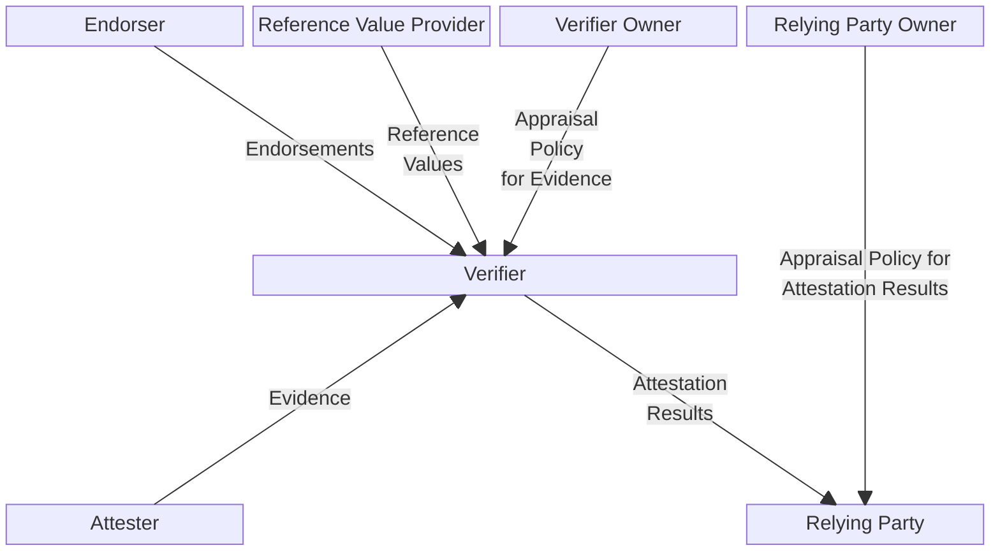

# Attestation in Contrast

This document describes the attestation architecture of Contrast, adhering to the definitions of Remote ATtestation procedureS (RATS) in [RFC 9334](https://datatracker.ietf.org/doc/rfc9334/).

## Attestation Architecture
Contrast integrates with the RATS architecture, leveraging their definition of roles and processes including *Attesters*, *Verifiers*, and *Relying Parties*.

```
     .--------.     .---------.       .--------.       .-------------.
    | Endorser |   | Reference |     | Verifier |     | Relying Party |
     '-+------'    | Value     |     | Owner    |     | Owner         |
       |           | Provider  |      '---+----'       '----+--------'
       |            '-----+---'           |                 |
       |                  |               |                 |
       | Endorsements     | Reference     | Appraisal       | Appraisal
       |                  | Values        | Policy for      | Policy for
       |                  |               | Evidence        | Attestation
        '-----------.     |               |                 | Results
                     |    |               |                 |
                     v    v               v                 |
                   .-------------------------.              |
           .------>|         Verifier        +-----.        |
          |        '-------------------------'      |       |
          |                                         |       |
          | Evidence                    Attestation |       |
          |                             Results     |       |
          |                                         |       |
          |                                         v       v
    .-----+----.                                .---------------.
    | Attester |                                | Relying Party |
    '----------'                                '---------------'
```
Figure 1: Conceptual Data Flow. Taken from [RFC 9334](https://datatracker.ietf.org/doc/rfc9334/).



- **Attester**: Assigned to entities that are responsible for creating *Evidence* which is then sent to a *Verifier*.
- **Verifier**: These entities utilize the *Evidence*, *Reference Values*, and *Endorsements*. They assess the trustworthiness of the *Attester* by applying an *Appraisal Policy* for *Evidence*. Following this assessment, *Verifiers* generate *Attestation Results* for use by *Relying Parties*. The *Appraisal Policy* for *Evidence* may be provided by the *Verifier Owner*, programmed into the *Verifier*, or acquired through other means.
- **Relying Party**: Assigned to entities that utilize *Attestation Results*, applying their own appraisal policies to make specific decisions, such as authorization decisions. This process is referred to as the "appraisal of Attestation Results." The *Appraisal Policy* for *Attestation Results* might be sourced from the *Relying Party Owner*, configured by the owner, embedded in the *Relying Party*, or obtained through other protocols or mechanisms.

## Components of Contrast's Attestation
The key components involved in the attestation process of Contrast are detailed below:

### Attester: Application Pods
This includes all Pods of the Contrast deployment that run inside Confidential Containers and generate cryptographic evidence reflecting their current configuration and state.
Their evidence is rooted in the [hardware measurements](../basics/confidential-containers.md) from the CPU and their [confidential VM environment](../components/runtime.md).
The details of this evidence are given below in the section on [Evidence Generation and Appraisal](#evidence-generation-and-appraisal).
In RATS terminology, these Pods implement a layered attestation environment:

```
              .-------------.
              |    CPU      |   Endorsement for CPU
              |   Vendor    +-----------------------.
              '-------------'                       |
                                                    v
              .-------------.   Reference      .-------------.
              | CLI +       |   Values for     |             |
              | Edgeless    +----------------->| Coordinator |
              | Systems     | CPU and Image,   |             |
              '-------------'                  '-------------'
                                                    ^
          .------------------------------------.    |
          |                                    |    | Layered
          |                                    |    | Evidence
          |   .---------------------------.    |    |   for
          |   | Initializer(C)            |    |    |  Image
          |   |             .-----------. |    |    |   and
          |   |   Target    | Attesting | |    |    |   CPU
          |   | Environment |Environment+-----------'
          |   |             |           | |    |
          |   |             '-----------' |    |
          |   |                 ^         |    |
          |   '--------------+--|---------'    |
          |          Collect |  | Evidence for |
          |          Claims  v  | Initializer  |
          |   .-----------------+---------.    |
          |   | Image(B):                 |    |
          |   | Kernel, initrd,           |    |
          |   | cmdline          Target   |    |
          |   |               Environment |    |
          |   |                 ^         |    |
          |   '-------------+--|---------'     |
          |         Collect |  | Evidence for  |
          |         Claims  v  |  Kernel and   |
          |                    | Runtime Policy|
          |   .----------------+----------.    |
          |   | CPU(A)                    |    |
          |   | AMD SEV,                  |    |
          |   | Intel TDX     Target      |    |
          |   |              Environment  |    |
          |   '---------------------------'    |
          |                                    |
          '------------------------------------'
```
Figure 2: Layered Attester. Taken from [RFC 9334](https://datatracker.ietf.org/doc/rfc9334/).

These pods run in Contrast's [runtime environment](../components/runtime.md), effectively within a confidential VM.
During launch, the CPU measures the initial memory content of the confidential VM that contains Contrast's pod-VM image and generates the corresponding attestation evidence.
The image is in [IGVM format](https://github.com/microsoft/igvm), encapsulating all information required to launch a virtual machine, including the kernel, the initramfs, and kernel cmdline.
The kernel cmdline contains the root hash for [dm-verity](https://www.kernel.org/doc/html/latest/admin-guide/device-mapper/verity.html) that ensures the integrity of the root filesystem.
The root filesystem contains the [initializer](../components/index.md#the-initializer) and all other components of the container's runtime environment such as the [guest agent](../basics/confidential-containers.md#kata-containers).
Therefore, the dm-verity root hash acts as the evidence for all userland components that are part of the root filesystem.

In the userland, the guest agent takes care of enforcing the containers [runtime policy](../components/index.md#runtime-policies).
While the policy is passed in during the initialization procedure via the Kata host, the evidence for the runtime policy is part of the CPU measurements.
During the [deployment](../deployment.md#generate-policy-annotations-and-manifest) the expected policy hash is annotated to the Kubernetes Pod resources.
On AMD SEV-SNP system's the policy's hash is then added to the CPU's attestation report via the `HOSTDATA` field by the hypervisor.
When provided with the policy from the Kata host, the guest agent verifies that the policy's hash matches the one in the `HOSTDATA` field.

In summary the Pod's evidence consists of the CPU report, the pod-VM image's measurements, and the runtime policy.
All of this layered evidence  is combined into one statement and passed to the verifier.

### Verifier: Coordinator and CLI
The [Coordinator](../components/index.md#the-coordinator) acts as a verifier within the Contrast deployment, configured with a [Manifest](../components/index.md#the-manifest) that defines the reference values and serves as an appraisal policy for all pods in the deployment.
It also pulls endorsements from hardware vendors to verify the hardware claims.
The Coordinator operates within the cluster as a confidential container and provides similar evidence as any other Pod when it acts as an attester.
In RATS terminology, the Coordinator's dual role is defined as a lead attester in a composite device which spans the entire deployment: Coordinator and the workload pods.
It collects evidence from other attesters and conveys it to a verifier, generating evidence about the layout of the whole composite device based on the Manifest as the appraisal policy.

```
                      .-----------------------------.
                      |           Verifier          |
                      '-----------------------------'
                                      ^
                                      |
                                      | Evidence of
                                      | Composite Device
                                      |
   .----------------------------------|-------------------------------.
   | .--------------------------------|-----.      .------------.     |
   | |  Collect             .---------+--.  |      |            |     |
   | |  Claims   .--------->|  Attesting |<--------+ Pod A      +-.   |
   | |           |          |Environment |  |      '-+----------' |   |
   | |  .--------+-------.  |            |<----------+ Pod B      +-. |
   | |  | Runtime Target |  |            |  |        '-+----------' | |
   | |  | Environment    |  |            |<------------+ ...        | |
   | |  |                |  '------------'  | Evidence '------------' |
   | |  '----------------'                  |    of                   |
   | |                                      |   Pods                  |
   | | Coordinator                          | (via Pod network)       |
   | '--------------------------------------'                         |
   |                                                                  |
   |                       Composite Device                           |
   '------------------------------------------------------------------'
```
Figure 3: Composite Device. Taken from [RFC 9334](https://datatracker.ietf.org/doc/rfc9334/).

The [CLI](../components/index.md#the-cli-command-line-interface) serves as the verifier for the Coordinator and the entire Contrast deployment, containing the reference values for the Coordinator and the endorsements from hardware vendors.
These reference values are built into the CLI during our release process and can be reproduced offline via reproducible builds.

### Relying Party: Data Owner
A relying party in the Contrast scenario could be, for example, the [data owner](../basics/security-benefits.md) that interacts with the application.
The relying party can use the CLI to obtain the attestation results and Contrast's [CA certificates](../architecture/certificates-and-identities/pki.md) bound to these results.
The CA certificates can then be used by the relying party to authenticate the application, for example through TLS connections.


## Evidence Generation and Appraisal

### Evidence Types and Formats
Several types of attestation evidence exist in Contrast:
- **The hardware attestation report**: For AMD SEV-SNP, this includes information such as chip identifier, platform info, microcode versions, and guest measurements. The report also contains the runtime policy hash and is signed by the CPU's private key.
- **The guest measurements**: A launch digest generated by the CPU, which is the hash of all initial guest memory pages, containing the kernel, initramfs, and kernel command line including the root filesystem's dm-verity root hash.
- **The runtime policy hash**: The hash of the Rego policy that defines all expected API commands and their values from the host to the Kata guest agent, including the dm-verity hashes for the container image layers, environment variables, and mount points.

### Appraisal Policies for Evidence
The appraisal policies in Contrast consist of two parts:
- **The Manifest**: A JSON file configuring the Coordinator with reference values for the runtime policy hashes for each pod in the deployment and the expected hardware attestation report evidence.
- **The CLI's appraisal policy**: Contains the Coordinator's guest measurements and its runtime policy. The policy is baked into the CLI during the build process and can be compared against the source code reference via reproducible builds.

## Summary

In summary, Contrast's attestation strategy follows the RATS guidelines and consists of two parts:
- A layered attestation environment for each individual instance of a Confidential Container in the deployment.
- The Coordinator attestation service as a lead attester that allows the transitive verification of the entire deployment as composite device.
