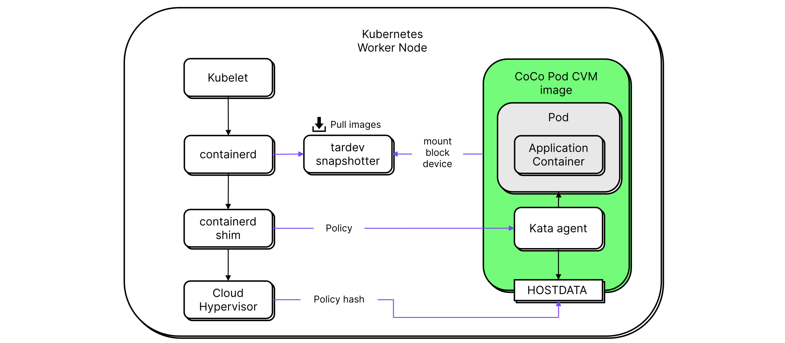

# Contrast Runtime

The Contrast runtime is responsible for starting pods as confidential virtual machines.
This works by specifying the runtime class to be used in a pod spec and by registering the runtime class with the API server.
The `RuntimeClass` resource defines a name for referencing the class and
a handler used by the container runtime (`containerd`) to identify the class.

```yaml
apiVersion: node.k8s.io/v1
kind: RuntimeClass
metadata:
  # This name is used by pods in the runtimeClassName field
  name: contrast-cc-abcdef
# This name is used by the
# container runtime interface implementation (containerd)
handler: contrast-cc-abcdef
```

Confidential pods that are part of a Contrast deployment need to specify the
same runtime class in the `runtimeClassName` field, so Kubernetes uses the
Contrast runtime instead of the default `containerd` / `runc` handler.

```yaml
apiVersion: v1
kind: Pod
spec:
  runtimeClassName: contrast-cc-abcdef
  # ...
```

## Node-level components

The runtime consists of additional software components that need to be installed
and configured on every SEV-SNP-enabled/TDX-enabled worker node.
This installation is performed automatically by the [`node-installer` DaemonSet](#node-installer-daemonset).



### Containerd shim

The `handler` field in the Kubernetes `RuntimeClass` instructs containerd not to use the default `runc` implementation.
Instead, containerd invokes a custom plugin called `containerd-shim-contrast-cc-v2`.
This shim is described in more detail in the [upstream source repository](https://github.com/kata-containers/kata-containers/tree/3.4.0/src/runtime) and in the [containerd documentation](https://github.com/containerd/containerd/blob/main/core/runtime/v2/README.md).

### Virtual machine manager (VMM)

The `containerd` shim uses a virtual machine monitor to create a confidential virtual machine for every pod.
On AKS, Contrast uses [`cloud-hypervisor`](https://www.cloudhypervisor.org).
On bare metal, Contrast uses [`QEMU`](https://www.qemu.org/).
The appropriate files are installed on every node by the [`node-installer`](#node-installer-daemonset).

### Snapshotters

Contrast uses [`containerd` snapshotters](https://github.com/containerd/containerd/tree/v1.7.16/docs/snapshotters/README.md) to provide container images to the pod-VM.
Each snapshotter consists of a host component that pulls container images and a guest component used to mount/pull container images.

On AKS, Contrast uses the [`tardev`](https://github.com/kata-containers/tardev-snapshotter) snapshotter to provide container images as block devices to the pod-VM.
The `tardev` snapshotter uses [`dm-verity`](https://docs.kernel.org/admin-guide/device-mapper/verity.html) to protect the integrity of container images.
Expected `dm-verity` container image hashes are part of Contrast runtime policies and are enforced by the kata-agent.
This enables workload attestation by specifying the allowed container image as part of the policy. Read [the chapter on policies](policies.md) for more information.

On bare metal, the image is pulled within the guest VM by the Kata guest components.

### Pod-VM image

Every pod-VM starts with the same guest image. It consists of an IGVM file and a root filesystem.
The IGVM file describes the initial memory contents of a pod-VM and consists of:

- Linux kernel image
- `initrd`
- `kernel commandline`

Additionally, a root filesystem image is used that contains a read-only partition with the user space of the pod-VM and a verity partition to guarantee the integrity of the root filesystem.
The root filesystem contains systemd as the init system, and the kata agent for managing the pod.

This pod-VM image isn't specific to any pod workload. Instead, container images are mounted at runtime.

## Node installer DaemonSet

The `RuntimeClass` resource above registers the runtime with the Kubernetes api.
The node-level installation is carried out by the Contrast node-installer
`DaemonSet` that ships with every Contrast release.

After deploying the installer, it performs the following steps on each node:

- Install the Contrast containerd shim (`containerd-shim-contrast-cc-v2`)
- Install `cloud-hypervisor` or `QEMU` as the virtual machine manager (VMM)
- Install an IGVM file or separate firmware and kernel files for pod-VMs of this class
- Install a read only root filesystem disk image for the pod-VMs of this class
- Backup any existing `containerd` configuration in the format
  `<containerd-path>/<config-name>.<time>.bak`
- Reconfigure `containerd` by adding a runtime plugin that corresponds to the `handler` field of the Kubernetes `RuntimeClass`
- Restart `containerd` to make it aware of the new plugin

## More on Confidential Containers

Contrast uses some building blocks from [Confidential Containers](https://confidentialcontainers.org) (CoCo), a [CNCF Sandbox project](https://www.cncf.io/projects/confidential-containers/) that aims to standardize confidential computing at the pod level.
The project is under active development and many of the high-level features are still in flux.
Contrast uses the more stable core primitive provided by CoCo: its Kubernetes runtime.

## Kubernetes RuntimeClass

Kubernetes can be extended to use more than one container runtime with [`RuntimeClass`](https://kubernetes.io/docs/concepts/containers/runtime-class/) objects.
The [Container Runtime Interface](https://kubernetes.io/docs/concepts/architecture/cri/) (CRI) implementation, for example containerd, dispatches pod management API calls to the appropriate `RuntimeClass`.
`RuntimeClass` implementations are usually based on an [OCI runtime](https://github.com/opencontainers/runtime-spec), such as `runc`, `runsc` or `crun`.
In CoCo's case, the runtime is Kata Containers with added confidential computing capabilities.

## Kata Containers

[Kata Containers](https://katacontainers.io/) is an OCI runtime that runs pods in VMs.
The pod VM spawns an agent process that accepts management commands from the Kata runtime running on the host.
There are two options for creating pod VMs: local to the Kubernetes node, or remote VMs created with cloud provider APIs.
Using local VMs requires either bare-metal servers or VMs with support for nested virtualization.
Local VMs communicate with the host over a virtual socket.
For remote VMs, host-to-agent communication is tunnelled through the cloud provider's network.

Kata Containers was originally designed to isolate the guest from the host, but it can also run pods in confidential VMs (CVMs) to shield pods from their underlying infrastructure.
In confidential mode, the guest agent is configured with an [Open Policy Agent](https://www.openpolicyagent.org/) (OPA) policy to authorize API calls from the host.
This policy also contains checksums for the expected container images.
It's derived from Kubernetes resource definitions and its checksum is included in the attestation report.

## AKS CoCo preview

[Azure Kubernetes Service](https://learn.microsoft.com/en-us/azure/aks/) (AKS) provides CoCo-enabled node pools as a [preview offering](https://learn.microsoft.com/en-us/azure/aks/confidential-containers-overview).
These node pools leverage Azure VM types capable of nested virtualization (CVM-in-VM) and the CoCo stack is pre-installed.
Contrast can be deployed directly into a CoCo-enabled AKS cluster.
