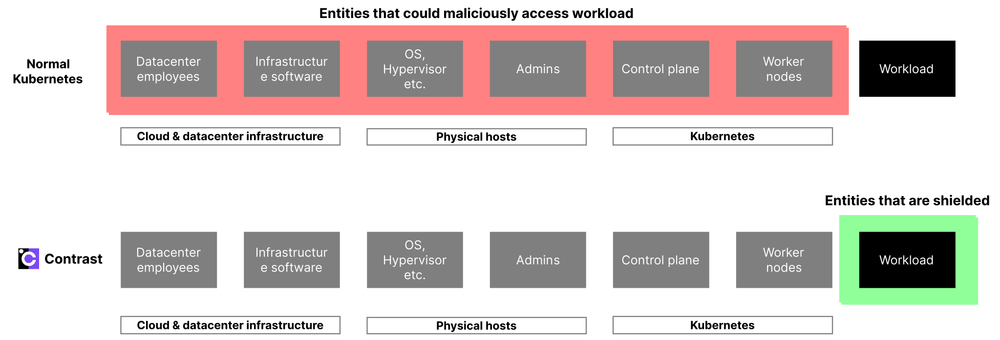
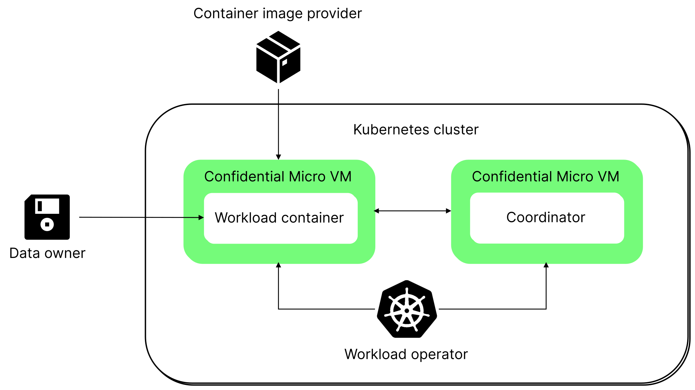

# Contrast security overview

This document outlines the security measures of Contrast and its capability to counter various threats effectively.
Contrast is designed to shield entire Kubernetes deployments from the infrastructure, enabling entities to manage sensitive information (such as regulated or personally identifiable information (PII)) in the public cloud, while maintaining data confidentiality and ownership.

Contrast is applicable in situations where establishing trust with the workload operator or the underlying infrastructure is challenging.
This is particularly beneficial for regulated sectors looking to transition sensitive activities to the cloud, without sacrificing security or compliance.
It allows for cloud adoption by maintaining a hardware-based separation from the cloud service provider.

## Components of a Contrast deployment

Contrast implements the [Confidential Containers](confidential-containers.md) concept.
Confidential Containers significantly decrease the size of the trusted computing base (TCB) of a Kubernetes deployment, by isolating each pod within its own confidential micro-VM environment.
The TCB is the totality of elements in a computing environment that must be trusted not to be compromised.
A smaller TCB results in a smaller attack surface. The following diagram shows how Confidential Containers remove the *cloud & datacenter infrastructure* and the *physical hosts*, including the hypervisor, the host OS, the Kubernetes control plane, and other components, from the TCB (red).
In the confidential context, represented by green, only the workload containers along with their confidential micro-VM environment are included within the Trusted Computing Base (TCB).
Their integrity is attested and can be [verified](../architecture/attestation/hardware.md).

Confidential Containers use [hardware-based mechanisms](../basics/confidential-containers.md), specifically leveraging CPU features, to ensure the isolation of the confidential context.
This implies that both the CPU and its microcode are integral components of the TCB.
However, it should be noted that the hardware aspects aren't depicted in the accompanying graphic.

A Contrast deployment has five core components:

* **The workload containers**: Container images that run in isolated [Confidential Container](confidential-containers.md) environments.
* **The runtime policies**: Policies that define the runtime environments for the workload containers.
* **The manifest**: A manifest file defining the reference values of an entire confidential deployment. It contains the policy hashes for all pods of the deployment and the expected hardware reference values for the Confidential Container runtime.
* **The Coordinator**: An attestation service that runs in a Confidential Container in the Kubernetes cluster. The Coordinator is configured with the manifest. User-facing, you can verify this service and the effective manifest using remote attestation, providing you with a concise attestation for the entire deployment. Cluster-facing, it verifies all pods and their policies based on remote attestation procedures and the manifest.
* **The protected data**: The data that's processed by the workload containers.

Contrast helps protect the workload and its runtime environment's integrity and confidentiality from inspection and tampering.
Furthermore, it provides the ability to attest this isolation and the workloads identity for the entire distributed application at any point in time in a single operation.

In a Contrast deployment, there are three parties:

* **The container image provider**, who creates the container images that represent the application that has access to the protected data.

* **The workload operator**, who runs the workload in a Kubernetes cluster. The operator typically has full administrative privileges to the deployment. The operator can manage cluster resources such as nodes, volumes, and networking rules, and the operator can interact with any Kubernetes or underlying cloud API.

* **The data owner**, who owns the protected data. A data owner can verify the deployment using the Coordinator attestation service. The verification includes the identity, integrity, and confidentiality of the workloads, the runtime environment and the access permissions.

Contrast supports a trust model where the container image provider, workload operator, and data owner are separate, mutually distrusting parties.

The following diagram shows the system components and parties.

## Examples of Contrasts use cases

Contrast helps you to isolate your workloads and data from the infrastructure and the cloud service provider. The following table describes three example use cases.

| Use Case                                 | Example Scenario                                                                                                                                                                                                                                                                                                                           |
|------------------------------------------|--------------------------------------------------------------------------------------------------------------------------------------------------------------------------------------------------------------------------------------------------------------------------------------------------------------------------------------------|
| Migrate sensitive workloads to the cloud | TechSolve Inc., a software development firm, aimed to enhance its defense-in-depth strategy for its cloud-based development environment, especially for projects involving proprietary algorithms and client data. Contrast adds robust, multi-layered security that protects proprietary algorithms and client data against a wide range of threats, including infrastructure-based attacks and insider risks.                                                                                       |
| Make your SaaS more trustworthy          | SaaSProviderX, a company offering cloud-based project management tools, sought to enhance its platform's trustworthiness amidst growing concerns about data breaches and privacy. Contrasts adds a new layer of verification and isolation to bolster its platform security, increased user trust, and solidified its reputation as a secure and reliable SaaS provider.   |
| Simplify regulatory compliance           | HealthSecure Inc. has been managing a significant volume of sensitive patient data on-premises. With the increasing demand for advanced data analytics and the need for scalable infrastructure, the firm decides to migrate its data analytics operations to the cloud. However, the primary concern is maintaining the confidentiality and security of patient data during and after the migration, in compliance with healthcare regulations. Contrasts helps leveraging confidential containers that ensure compliance and maintain data confidentiality, thereby enhancing their analytics capabilities securely.                            |

In each scenario, Contrast ensures exclusive data access and processing capabilities are confined to the designated workloads. It achieves this by effectively isolating the workload from the infrastructure and other components of the stack. Data owners are granted the capability to audit and approve the deployment environment before submitting their data, ensuring a secure handover. Meanwhile, workload operators are equipped to manage and operate the application seamlessly, without requiring direct access to either the workload or its associated data.

## Protecting the integrity and confidentiality of a workload

To help protect the workload from an untrusted workload operator and the infrastructure, Contrast implements the following security controls:

* An attestation process detects modifications to the workload image or its confidential container. This control helps protect the workload's integrity pre-attestation.
* A runtime policy and prevents the workload operator from accessing or compromising the instance at runtime. This control protects a workload's integrity and confidentiality post-attestation.

### Attestation process

The [attestation architecture](../architecture/attestation/hardware.md) describes Contrast's chain of trust and the attestation process in detail.

## Threat model and mitigations

This section describes the threat vectors that Contrast helps to mitigate.

The following attacks are out of scope for this document:

* Attacks on the application code itself, such as insufficient access controls.
* Attacks on the Confidential Computing hardware directly, such as side-channel attacks.
* Attacks on the availability, such as denial-of-service (DOS) attacks.

### Possible attacks

Contrast is designed to defend against five possible attacks:

* **A malicious cloud insider**: malicious employees or third-party contractors of cloud service providers (CSPs) potentially have full access to various layers of the cloud infrastructure. That goes from the physical datacenter up to the hypervisor and Kubernetes layer. For example, they can access the physical memory of the machines, modify the hypervisor, modify disk contents, intercept network communications, and attempt to compromise the confidential container at runtime. A malicious insider can expand the attack surface or restrict the runtime environment. For example, a malicious operator can add a storage device to introduce new attack vectors. As another example, a malicious operator can constrain resources such as limiting a guest's memory size, changing its disk space, or changing firewall rules.
* **A malicious cloud co-tenant**: malicious cloud user ("hackers") may break out of their tenancy and access other tenants' data. Advanced attackers may even be able to establish a permanent foothold within the infrastructure and access data over a longer period. The threats are analogous to the *cloud insider access* scenario, without the physical access.
* **A malicious workload operator**: malicious workload operators, for example Kubernetes administrators, have full access to the workload deployment and the underlying Kubernetes platform. The threats are analogously to the *cloud insider access* scenario, with access to everything that's above the hypervisor level.
* **A malicious attestation client**: this attacker connects to the attestation service and sends malformed request.
* **A malicious container image provider**: a malicious container image provider has full control over the application development itself. This attacker might release a malicious version of the workload containing harmful operations.

### Attack surfaces

The following table describes the attack surfaces that are available to attackers.

| Attacker                                       | Target                           | Attack surface           | Risks                                                                                                                                            |
|------------------------------------------------|----------------------------------|--------------------------|--------------------------------------------------------------------------------------------------------------------------------------------------|
| Cloud insider                                  | Confidential Container, Workload | Physical memory          | Attacker can dump the physical memory of the workloads.                                                                                            |
| Cloud insider, cloud hacker, workload operator | Confidential Container, Workload | Disk reads               | Anything read from the disk is within the attacker's control.                                                                                    |
| Cloud insider, cloud hacker, workload operator | Confidential Container, Workload | Disk writes              | Anything written to disk is visible to an attacker.                                                                                              |
| Cloud insider, cloud hacker, workload operator | Confidential Container, Workload | Kubernetes Control Plane | Instance attributes read from the Kubernetes control plane, including mount points and environment variables, are within the attacker's control. |
| Cloud insider, cloud hacker, workload operator | Confidential Container, Workload | Container Runtime        | The attacker can use container runtime APIs (for example "kubectl exec") to perform operations on the workload container.                                 |
| Cloud insider, cloud hacker, workload operator | Confidential Container, Workload | Network                  | Intra-deployment (between containers) as well as external network connections to the image repository or attestation service can be intercepted.    |
| Attestation client                             | Coordinator attestation service  | Attestation requests     | The attestation service has complex, crypto-heavy logic that's challenging to write defensively.                                                |
| Container image provider                                 | Workload                         | Workload                 | This attacker might release an upgrade to the workload containing harmful changes, such as a backdoor.                                                               |                                                             |

### Threats and mitigations

The container root file system with [integrity protection](../architecture/confidential-containers.md) is designed to mitigate risks from disk attacks.
Additionally, the container has no writeable disk partition mounted, hence, data is only stored in-memory and never disclosed to disk.

Risks from network attacks are mitigated by having [authenticated, end-to-end encrypted channels](../architecture/network-encryption/sidecar.md).
An [attestation protocol](../architecture/attestation/hardware.md) helps protect the boot sequence.
[Runtime policies](../architecture/attestation/runtime-policies.md) verify the runtime environment configuration read from the Kubernetes control plane.

The following tables describe the threats and mitigations:

* Attacks on the confidential container environment
* Attacks on the attestation service
* Attacks on workloads

#### Attacks on the confidential container environment

This table describes potential threats and mitigation strategies related to the confidential container environment.

| Threat                                                                                                                     | Mitigation                                                                                                                                                                                                                                                                                                                                  | Mitigation implementation           |
|----------------------------------------------------------------------------------------------------------------------------|---------------------------------------------------------------------------------------------------------------------------------------------------------------------------------------------------------------------------------------------------------------------------------------------------------------------------------------------|-------------------------------------|
| An attacker intercepts the network connection of the launcher or image repository.                                         | An attacker can change the image URL and control the workload binary. However these actions are reflected in the attestation report. The image repository isn't controlled using an access list, therefore the image is assumed to be viewable by everyone. You must ensure that the workload container image doesn't contain any secrets. | Within the Contrast container image |
| An attacker modifies the workload image on disk after it was downloaded and measured.                                      | This threat is mitigated by a read-only partition that's integrity-protected. The workload image is protected by dm-verity.                                                                                                                                                                                 | Within the Contrast pod VM image |
| An attacker modifies a container's runtime environment configuration in the Kubernetes control plane. | The attestation process and the runtime policies detects unsafe configurations that load non-authentic images or perform any other modification to the expected runtime environment.                                                                                                                                                       | Within the runtime policies         |

#### Attacks on the Coordinator attestation service

This table describes potential threats and mitigation strategies to the attestation service.

| Threat                                                                                                                      | Mitigation                                                                                                                                                                                                                                                                                                                                                                                                                                                                                             | Mitigation implementation                                     |
|-----------------------------------------------------------------------------------------------------------------------------|--------------------------------------------------------------------------------------------------------------------------------------------------------------------------------------------------------------------------------------------------------------------------------------------------------------------------------------------------------------------------------------------------------------------------------------------------------------------------------------------------------|---------------------------------------------------------------|
| An attacker intercepts the Coordinator deployment and modifies the image or hijacks the runtime environment.                | This threat is mitigated by having an attestation procedure and attested, encrypted TLS connections to the Coordinator. The attestation evidence for the Coordinator image is distributed with our releases, protected by supply chain security and fully reproducible.                                                                                                                                                                                                                                                    | Within the CLI, and the Coordinator                            |
| An attacker intercepts the network connection between the workload and the Coordinator and reads secret keys from the wire. | This threat is mitigated by having an attested, encrypted TLS connection. This connection helps protect the token from passive eavesdropping. The attacker can't create valid workload certificates that would be accepted in Contrast's service mesh. An attacker can't impersonate a valid workload container because the container's identity is guaranteed by the attestation protocol. | Within the network between your workload and the Coordinator. |
| An attacker exploits parsing discrepancies, which leads to undetected changes in the attestation process.                   | This risk is mitigated by having a parsing engine written in memory-safe Go that's tested against the attestation specification of the hardware vendor. The runtime policies are available as an attestation artifact for further inspection and audits to verify their effectiveness.                                                                                                                                                                                                                 | Within the Coordinator                                        |
| An attacker uses all service resources, which brings the Coordinator down in a denial of service (DoS) attack.              | This reliability risk is mitigated by having a distributed, Coordinator service that can be easily replicated and scaled out as needed.                                                                                                                                                                                                                                                                                                                                                                | Within the Coordinator                                        |
#### Attacks on workloads

This table describes potential threats and mitigation strategies related to workloads.

| Threat                                                                         | Mitigation                                                                                                                                                                             | Mitigation implementation           |
|--------------------------------------------------------------------------------|----------------------------------------------------------------------------------------------------------------------------------------------------------------------------------------|-------------------------------------|
| An attacker intercepts the network connection between two workload containers. | This threat is mitigated by having transparently encrypted TLS connections between the containers in your deployment.                                                                  | Within the Contrast container image |
| An attacker reads or modifies data written to disk via persistent volumes.     | Currently persistent volumes aren't supported in Contrast. In the future, this threat is mitigated by encrypted and integrity-protected volume mounts.                                | Within the Contrast container image |
| An attacker publishes a new image version containing malicious code.           | The attestation process and the runtime policies require a data owner to accept a specific version of the workload and any update to the workload needs to be explicitly acknowledged. | Within the attestation procedure    |
