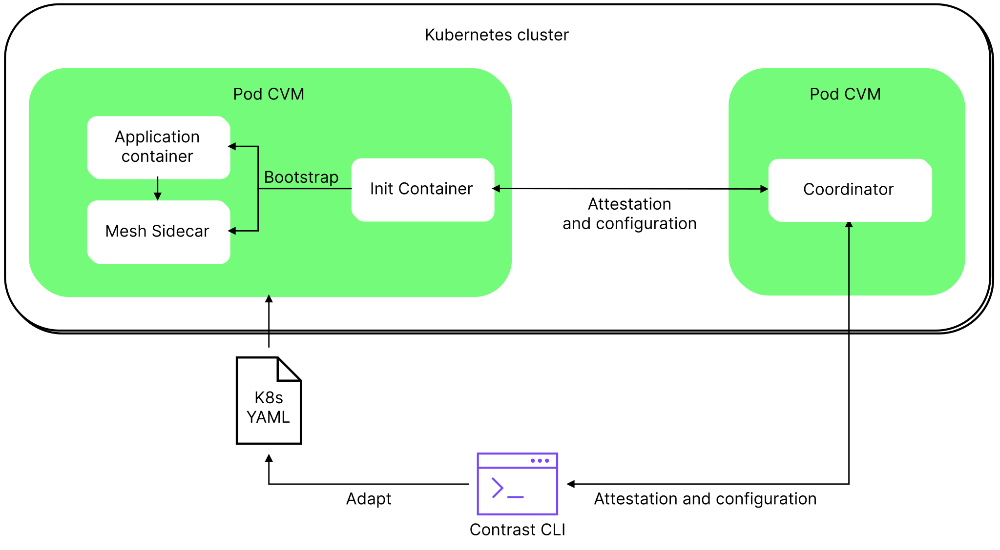

# Components

Contrast is composed of several key components that work together to manage and scale confidential containers effectively within Kubernetes environments.
This page provides an overview of the core components essential for deploying and managing Contrast.

## The CLI (Command Line Interface)

The CLI serves as the primary management tool for Contrast deployments. It is designed to streamline the configuration and operation of Contrast in several ways:

* Installation and Setup: The CLI facilitates the installation of the necessary runtime classes required for Contrast to function within a Kubernetes cluster.
* Policy Generation: It allows users to generate runtime policies, adapt the deployment files, and generate the Contrast manifest.
* Configuration Management: Through the CLI, users can configure the Contrast Coordinator with the generated manifest.
* Verification and Attestation: The CLI provides tools to verify the integrity and authenticity of the Coordinator and the entire deployment via remote attestation.

## The Coordinator

The Contrast Coordinator is the central remote attestation service of a Contrast deployment.
It runs inside a confidential container inside your cluster.
The Coordinator can be verified via remote attestation, and a Contrast deployment is self-contained.
The Coordinator is configured with a *manifest*, a configuration file containing the reference attestation values of your deployment.
It ensures that your deployment's topology adheres to your specified manifest by verifying the identity and integrity of all confidential pods inside the deployment.
The Coordinator is also a certificate authority and issues certificates for your workload pods during the attestation procedure.
Your workload pods can establish secure, encrypted communication channels between themselves based on these certificates and the Coordinator as the root CA.
As your app needs to scale, the Coordinator transparently verifies new instances and then provides them with their certificates to join the deployment.

To verify your deployment, the Coordinator's remote attestation statement combined with the manifest offers a concise single remote attestation statement for your entire deployment.
A third party can use this to verify the integrity of your distributed app, making it easy to assure stakeholders of your app's identity and integrity.

## The Manifest

The manifest is the configuration file for the Coordinator, defining your confidential deployment.
It's automatically generated from your deployment by the Contrast CLI.
It currently consists of the following parts:

* *Policies*: The identities of your Pods, represented by the hashes of their respective runtime policies.
* *Reference Values*: The remote attestation reference values for the Kata confidential micro-VM that's the runtime environment of your Pods.
* *WorkloadOwnerKeyDigest*: The workload owner's public key digest. Used for authenticating subsequent manifest updates.

## Runtime Policies

Runtime Policies are a mechanism to enable the use of the untrusted Kubernetes API for orchestration while ensuring the confidentiality and integrity of your confidential containers.
They allow us to enforce the integrity of your containers' runtime environment as defined in your deployment files.
The runtime policy mechanism is based on the Open Policy Agent (OPA) and translates the Kubernetes deployment YAML into the Rego policy language of OPA.
The Kata Agent inside the confidential micro-VM then enforces the policy by only acting on permitted requests.
The Contrast CLI provides the tooling for automatically translating Kubernetes deployment YAML into the Rego policy language of OPA.

The trust chain goes as follows:

1. The Contrast CLI generates a policy and attaches it to the pod definition.
2. Kubernetes schedules the pod on a node with the confidential computing runtime.
3. Containerd takes the node, starts the Kata Shim and creates the pod sandbox.
4. The Kata runtime starts a CVM with the policy's digest as `HOSTDATA`.
5. The Kata runtime sets the policy using the `SetPolicy` method.
6. The Kata agent verifies that the incoming policy's digest matches `HOSTDATA`.
7. The CLI sets a manifest in the Contrast Coordinator, including a list of permitted policies.
8. The Contrast Coordinator verifies that the started pod has a permitted policy hash in its `HOSTDATA` field.

After the last step, we know that the policy hasn't been tampered with and, thus, that the workload is as intended.

## The Initializer

Contrast provides an Initializer that handles the remote attestation on the workload side transparently and
fetches the workload certificate. The Initializer runs as an init container before your workload is started.
It provides the workload container and the [service mesh sidecar](service-mesh.md) with the workload certificates.

## The Contrast runtime

Contrast depends on a Kubernetes [runtime class](https://kubernetes.io/docs/concepts/containers/runtime-class/), which is installed
by the `node-installer` DaemonSet.
This runtime consists of a containerd runtime plugin, a virtual machine manager (cloud-hypervisor), and a podvm image (IGVM and rootFS).
The installer takes care of provisioning every node in the cluster so it provides this runtime class.
