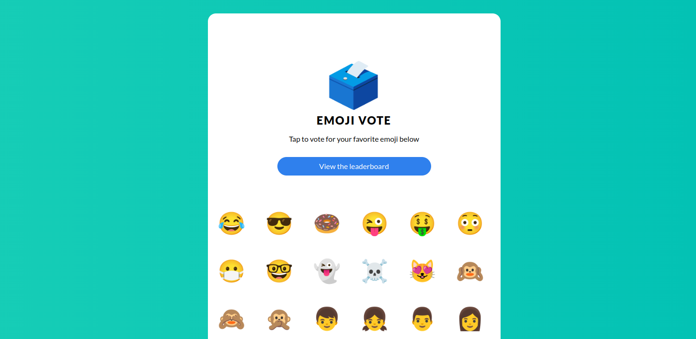

# Confidential voting

<!-- TODO(katexochen): create a screenshot with fixed emoji font and fixed format -->


This tutorial guides you through deploying [emojivoto](https://github.com/BuoyantIO/emojivoto) as a
confidential Contrast deployment. Emojivoto is an example app that allows users to vote for different emojis and view votes cast on a leaderboard. It has a microservice architecture consisting of a
web frontend (`web`), a gRPC backend for listing available emojis (`emoji`), and a backend for
the voting and leaderboard logic (`voting`). The `vote-bot` simulates user traffic by submitting
votes to the frontend.

<!-- TODO(katexochen): recreate in our design -->


### Motivation

Using a voting service, users' votes are considered highly sensitive data, as we require
a secret ballot. Also, users are likely interested in the fairness of the ballot. For
both requirements, we can use Confidential Computing and, specifically, workload attestation
to prove to those interested in voting that the app is running in a protected environment
where their votes are processed without leaking to the platform provider or workload owner.

## Prerequisites

- **Installed Contrast CLI.**
  See the [installation instructions](./../getting-started/install.md) on how to get it.
- **Running cluster with Confidential Containers support.**
  Please follow the [cluster setup instructions](./../getting-started/cluster-setup.md)
  for creating a cluster.
- **Get the deployment.** This is currently available as part of the preview bundle.

## Steps to deploy emojivoto with Contrast

### Deploy the Contrast Coordinator

Deploy the Contrast Coordinator, comprising a single replica deployment and a
LoadBalancer service, into your cluster:

```sh
kubectl apply -f coordinator.yml
```

### Generate policy annotations and manifest

Run the `generate` command to generate the execution policies and add them as
annotations to your deployment files. A `manifest.json` file with the reference values
of your deployment will be created:

```sh
contrast generate deployment/
```

:::note[Runtime class and Initializer]

The deployment YAML shipped for this demo is already configured to be used with Contrast.
A runtime class `kata-cc-isolation` was added to the pods to signal they should be run
as Confidential Containers. In addition, the Contrast Initializer was added
as an init container to these workloads to facilitate the attestation and certificate pulling
before the actual workload is started.

:::

### Set the manifest

Configure the coordinator with a manifest. It might take up to a few minutes
for the load balancer to be created and the Coordinator being available.

```sh
coordinator=$(kubectl get svc coordinator -o=jsonpath='{.status.loadBalancer.ingress[0].ip}')
echo "The user API of your Contrast Coordinator is available at $coordinator:1313"
contrast set -c "${coordinator}:1313" deployment/
```

The CLI will use the embedded reference values to attest the Coordinator deployment
during the TLS handshake. If the connection succeeds, we are ensured that the Coordinator
deployment hasn't been tampered with.

### Deploy emojivoto

Now that the coordinator has a manifest set, which defines the emojivoto deployment as an allowed workload,
we can deploy the application:

```sh
kubectl apply -f deployment/
```

:::note[Inter-deployment communication]

The Contrast Coordinator issues mesh certificates after successfully validating workloads.
These certificates can be used for sercure inter-deployment communication. The Initializer
sends an attestation report to the Coordinator, retrieves certificates and a private key in return
and writes them to a volumeMount. The emojivoto version we are using is patched to only communicate
via mTLS (the original app talks plain HTTP). The different parts of the workload are configured
to use the credentials from the volumeMount when communicating with each other.

:::

## Voter's perspective: verifying the ballot

As voters, we want to verify the fairness and confidentiality of the deployment before
deciding to vote. Regardless of the scale of our distributed deployment, Contrast only
needs a single remote attestation step to verify the deployment. By doing remote attestation
of the Coordinator, we transitively verify those systems the Coordinator has already attested
or will attest in the future. Successful verification of the Coordinator means that
we can be sure it will enforce the configured manifest.

### Attest the Coordinator

A potential voter can verify the Contrast deployment using the verify
command:

```sh
contrast verify -c "${coordinator}:1313"
```

The CLI will attest the Coordinator using embedded reference values. If the command succeeds,
the Coordinator deployment was successfully verified to be running in the expected Confidential
Computing environment with the expected code version. The Coordinator will then return its
configuration over the established TLS channel. The CLI will store this information, namely the root
certificate of the mesh (`mesh-root.pem`) and the history of manifests, into the `verify/` directory.
In addition, the policies referenced in the manifest history are also written into the same directory.

### Manifest history and artifact audit

In the next step, the Coordinator configuration that was written by the `verify` command needs to be audited.
A potential voter should inspect the manifest and the referenced policies. They could delegate
this task to an entity they trust.

### Confidential connection to the attested workload

After ensuring the configuration of the Coordinator fits the expectation, you can securely connect
to the workloads using the Coordinator's `mesh-root.pem` as a trusted CA certificate.

To access the web frontend, expose the service on a public IP address via a LoadBalancer service:

```sh
kubectl patch svc web-svc -p '{"spec": {"type": "LoadBalancer"}}'
timeout 30s bash -c 'until kubectl get service/web-svc --output=jsonpath='{.status.loadBalancer}' | grep "ingress"; do sleep 2 ; done'
lbip=$(kubectl get svc web-svc -o=jsonpath='{.status.loadBalancer.ingress[0].ip}')
echo $lbip
```

:::info

By default, certificates are issued with a wildcard DNS entry. Since we are accessing the load balancer via IP, the SAN checks the certificate for IP entries in the SAN field. Since the certificate doesn't contain any IP entries as SAN, the validation fails.
Hence, certificate validation will fail with using curl:

```sh
$ curl --cacert ./verify/mesh-root.pem "https://${lbip}:443"
curl: (60) SSL: no alternative certificate subject name matches target host name '203.0.113.34'
```

:::

To validate the certificate with the `mesh-root.pem` locally, use `openssl` instead:

```sh
openssl s_client -showcerts -connect ${lbip}:443 </dev/null | sed -n -e '/-.BEGIN/,/-.END/ p' > certChain.pem
awk 'BEGIN {c=0;} /BEGIN CERT/{c++} { print > "cert." c ".pem"}' < certChain.pem
openssl verify -verbose -trusted verify/mesh-root.pem -- cert.1.pem
```
