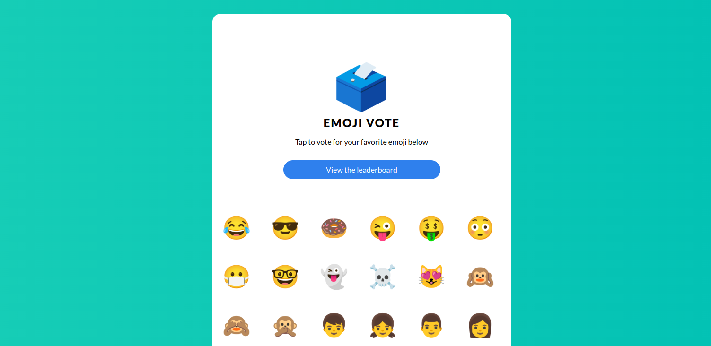

# Overview

This tutorial shows you how to make a Kubernetes deployment confidential using Contrast. We'll start with a non-confidential deployment of a simple application.

## Workflow

We’ll use the [emojivoto app](https://github.com/BuoyantIO/emojivoto) and walk through all the steps needed to make it confidential. You can follow along or apply the steps to your own app.

To make your app confidential with Contrast, you need to follow these steps:

1. [Install and set up](./cluster-setup):
   Install the Contrast CLI and prepare your cluster to support confidential containers.

2. [Deploy your workload](./deployment):
   Update your app’s deployment to work with Contrast:

   1. Adjust deployment files: Modify the deployment resources to integrate Contrast.
   2. Deploy Contrast runtime: Add a custom runtime to run your workloads inside Confidential Virtual Machines (CVMs).
   3. Generate policy annotations and manifest: Use the Contrast CLI to pre-process the deployment files and generate a manifest—a file that defines the secure and trusted state of your deployment.
   4. Deploy Contrast coordinator: This additional workload enforces and verifies the trusted and confidential state of your deployment.
   5. Deploy application: Finally, deploy your application.

3. [Verify deployment](.):
   Make sure your app is running in a secure and trusted environment.

4. [Securely connect to the app](.):
   Connect through a secure channel backed by confidential computing hardware. This removes the need for users to trust you as a service provider.

## Emojivoto app

We use the [emojivoto app](https://github.com/BuoyantIO/emojivoto) as our example. It's a microservice application where users vote for their favorite emoji, and votes are shown on a leaderboard.

The app includes:

- A web frontend (`web`)
- A gRPC backend that lists emojis (`emoji`)
- A backend for handling votes and leaderboard logic (`voting`)
- A `vote-bot` that simulates users by sending votes to the frontend

Emojivoto is a fun example, but it still handles data that could be considered sensitive.

Contrast protects emojivoto in two key ways:

1. It shields the entire app from the underlying infrastructure.
2. It can be configured to block data access even from the app's administrator.

In this setup, users can be sure that their votes stay private.

