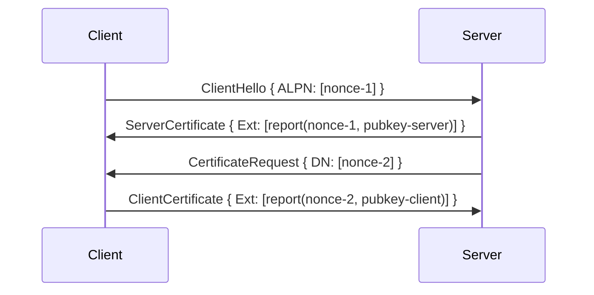

# Attested TLS

Remote attestation verifies the integrity of code and configuration deployed to a confidential VM (CVM).
The concept is covered in depth on the [remote attestation](../attestation/overview.md) page.
Contrast uses remote attestation in two ways:

1. The Coordinator verifies workload initializers, according to the permitted workloads in the manifest.
2. Workload owners and data owners verify the Coordinator, according to its reproducible reference values.

Most of the time, verifiers want to establish a secure channel to the attester in order to exchange further messages.
For example, the Coordinator hands out secrets to workloads or seed share owners over this secure channel.
Contrast uses a protocol on top of TLS 1.3, together referred to as _aTLS_, to establish such a channel and verify the attestation at the same time.

## Conceptual messages

A TLS connection is established between a client and a server.
Contrast's aTLS, on the other hand, can attest unidirectional (client to server or server to client) and even bidirectional.
To avoid confusion, we're going to refer to the part requesting an attestation document as the _initiator_ and the part producing the document as the _responder_.

The protocol starts with the initiator creating a random value called a nonce.
This nonce is intended to demonstrate freshness of the attestation evidence.
If the responder embeds this nonce into the evidence, the initiator knows that the evidence was created specifically for this connection.

Next, the initiator sends an attestation request, including the nonce, to the responder.
The responder creates a fresh asymmetric private key, self-signs a certificate with this key, and uses both to establish a TLS connection to the initiator.
It also computes a cryptographic hash over the nonce and the public key, and requests an attestation report using the hash as `REPORTDATA`.

The responder now sends the attestation report back to the initiator, over the TLS channel just established.
The initiator observes the public key used by the responder, and calculates the expected hash from nonce and public key.
Finally, the initiator verifies that the attestation evidence matches the reference values and that the `REPORTDATA` is set to the expected hash.

At this point, the initiator knows that the responder runs the expected software, because it verified the evidence.
It can also be certain that the other end of the TLS channel terminates at the responder, because it knows that the expected software generated the key.
The initiator also knows that the key was generated for this TLS connection only because of the nonce embedded in the attestation report.
Thus, the attestation evidence is cryptographically tied to the established TLS channel, and the initiator successfully authenticated the responder.

## TLS extensions

Contrast embeds the exchange of attestation requests and responses into the TLS handshake.
Since there is no standard for such an embedding yet, Contrast repurposes existing TLS extension points.
While these weren't originally designed for conveying attestation documents, this approach allows to use Go's TLS implementation without modification.

To illustrate the full protocol, we're going to discuss mutual attestation, where both the TLS client and the TLS server act as initiator and responder.
For single-sided attestation, the respective requests and responses are simply not sent.

When a client initiates a TLS connection, it starts the TLS handshake by sending a `ClientHello` message to the server.
The request for attestation is included as an [Application-Layer Protocol Negotiation (ALPN)](https://www.rfc-editor.org/rfc/rfc7301) next protocol choice.
The server parses the nonce from the protocol string and creates the TLS private key and the attestation report.
It embeds the report as an [X.509 certificate extension](https://www.rfc-editor.org/rfc/rfc5280#section-4.2) into the self-signed certificate and sends the `ServerHello` and `ServerCertificate` TLS messages.

Now the server sends a [`CertificateRequest`](https://www.rfc-editor.org/rfc/rfc5246#section-7.4.4) message to the client, embedding the nonce into the _Distinguished Name_ field.
The client parses the nonce from this field and creates the TLS private key and the attestation report.
Like the server, it embeds the report as a certificate extension and sends it back to the server with the `ClientCertificate` message.

The following diagram shows the relevant messages carrying attestation protocol information.
Some messages of the TLS 1.3 handshake that aren't relevant to attestation are omitted.

