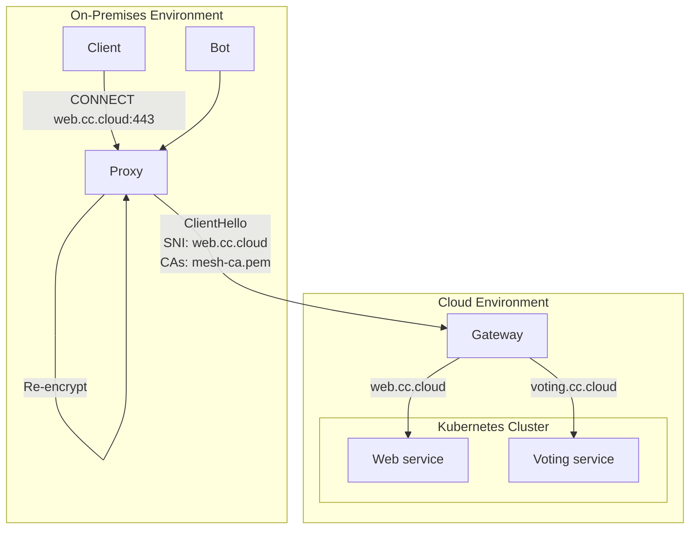
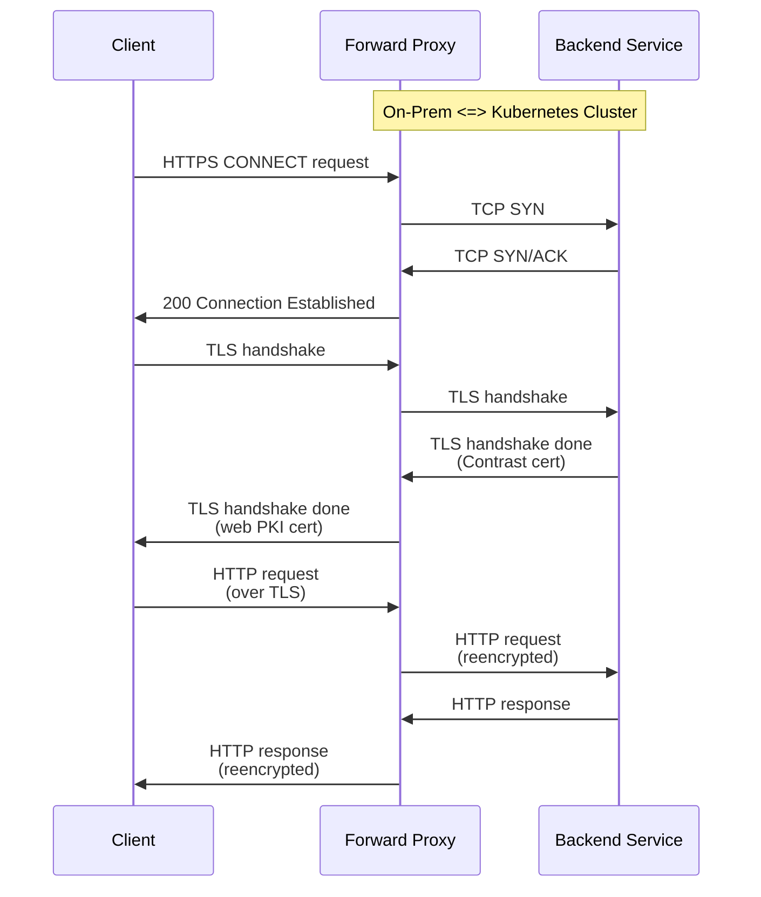

# RFC 014: HTTP Proxies

## Background

Use of HTTP is pervasive in modern applications, and we expect many Contrast workloads exposing an HTTP service, especially at the cluster edge.
Pretty much all HTTP clients integrate with the so-called [web PKI], which tightly controls who is authorized to sign certificates for the web.
Contrast, on the other hand, has its own PKI with signing policies and semantics that differ from the web PKI.
This prevents regular HTTP clients from interacting with Contrast in the intended fashion.

While it's generally possible to configure clients with additional CA certificates, it's sometimes not easy or may lead to undesirable side effects.
Browsers, in particular, are often configured centrally and don't allow individuals to add CA certificates for compliance reasons.
But even if a central authority were to bless the CA certificate, care must be taken to not weaken other connections.

Integrating Contrast logic into standard HTTP clients is infeasible, so we're looking for an alternative solution to make standard HTTP clients compatible with workloads using Contrast certificates.

[web PKI]: https://icannwiki.org/Web_PKI

## Requirements

- Allow standard HTTP clients to connect to servers running behind a service mesh ingress or using the mesh certificate directly.
- While keeping the traffic confidential up to the client's environment (local machine or internal network).
- Without increasing risk for applications in the cluster.

## Proposal

This proposal relies on the HTTP `CONNECT` verb and the associated `HTTP_PROXY` settings, which are [widely supported across browsers](https://developer.mozilla.org/en-US/docs/Web/HTTP/Reference/Methods/CONNECT#browser_compatibility) and libraries.
The overall idea is to deploy a local proxy that terminates TLS traffic using Contrast certificates and re-encrypts them with a web PKI certificate.

### Setup example

In order to make the proposal more concrete, we're going to explain it alongside an example setup.
The Kubernetes cluster has a confidential `web service`, for example the Emojivoto one.
It's exposed on a public IP using the Gateway API, possibly together with other services.
Service mesh ingress is configured to not require a client certificate.
DNS is configured to resolve the domain `web.cc.cloud` to the gateway IP.
On premises, there's a proxy running at `proxy.internal` that can connect to the public gateway IP.

### Client configuration

The client browser is configured to use `proxy.internal` as its `HTTP_PROXY`.

### Forward proxy

The forward proxy runs in a trusted environment and listens for `CONNECT` requests.
It's configured with the following:

- A CA certificate returned by `contrast verify` (mesh CA or root CA).
  See the discussion in the appendix about integrating Contrast verification logic directly.
- A list of hosts and ports that are allowed to be tunnelled.
  We can introduce a special "everything" syntax, if needed, to accelerate development.
- The certificate for the domain names used by backend services (`web.cc.cloud` for the example).

The life of a proxied connection then looks like this:

0. The client browses to `https://web.cc.cloud`.
1. The browser issues a `CONNECT web.cc.cloud:443` request to the proxy.
2. The proxy establishes a TCP connection to the target service.
   If that succeeds, the proxy returns `200 OK` to the client to indicate tunnel establishment, otherwise a `503 Service Unavailable`.
3. The browser initiates a TLS connection over the tunnel, expecting a web PKI certificate for `web.cc.cloud`.
4. The proxy receives the `ClientHello` and initiates a similar TLS connection (ALPN) to the backend, verified with the Contrast CA certificate.
5. After the backend session is established, the proxy responds to the client with similar protocol options and uses its web PKI certificate for signing.
6. When both TLS sessions are established, the proxy routes traffic back and forth until the sessions close.

## Alternatives considered

### Application gateway

Instead of a simple reverse proxy, we could come up with a full-fledged application gateway.
Such a gateway could route requests to backends and take care of user authentication/authorization.

- There's no standard, and thus it's very likely that our gateway would be unusable for most customers.
- If the gateway terminates TLS traffic, it would need to run inside a TEE itself, making it again more complicated to expose.

### Proxy at the transport layer

- No standard for such proxy (SOCKS5, but not widely usable).
- Thus, would need a listener for each remote service (like service mesh outbound)

### Hijack local traffic (`TPROXY`)

- Needs elevated privileges and is hard to get right.

### Embed Coordinator certificate into web PKI

- Fails security goals (any web CA can mint certificates), unless attestation is included.
- Will require attested TLS availability in client software (far out).

### Configure trust store with Contrast CA certs

This is the current status quo, which works but may be inconvenient, especially in large orgs.
Those large orgs are usually running their own CAs, so they could sign the mesh CA key with another intermediate, possibly adding name constraints.

## Appendix

### Contrast integration

This proposal deliberately focuses on the practical TLS-side of things without talking about Contrast verification.
However, the proxy could trivially be extended with Contrast functionality, or a verifier could run next to the proxy, supplying it with certificate updates.

The main question here is how such a verifier would learn about a Contrast manifest update, and how it would verify the new manifest.
It would need to be configured with a source of trusted manifest histories, a transparency log for example.
Furthermore, it would need direct access to the Coordinator, which may not be a desirable configuration (DoS concerns).

Since these issues are orthogonal to the goals of this RFC, they aren't discussed here.
